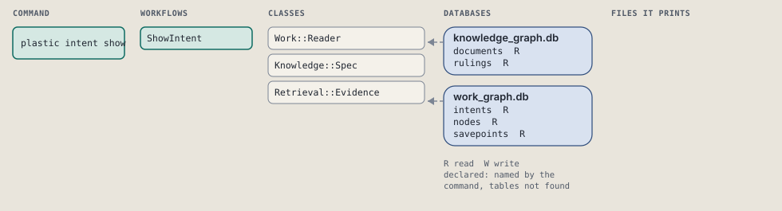
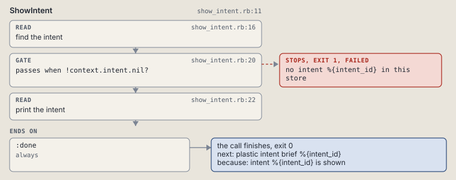

# plastic intent show

Print one intent's status, criteria, decisions, rulings and nodes.

```sh
plastic intent show ID
```

The command is `IntentShow`, in [`intent_show.rb:9`](../../../../scripts/lib/plastic/commands/intent_show.rb#L9). The words on this page, such as gate, step and outcome, are explained in [the command DSL](../../dsl/README.md).

| Argument or option | What it gives | Default |
| --- | --- | --- |
| `ID` | the intent | |

## What it touches



## How the call flows


| Workflow | Kind | Code |
| --- | --- | --- |
| [ShowIntent](#showintent) | code | [`show_intent.rb:11`](../../../../scripts/lib/plastic/workflows/show_intent.rb#L11) |

### ShowIntent

The code workflow `:code_show_intent`, in [`show_intent.rb:11`](../../../../scripts/lib/plastic/workflows/show_intent.rb#L11).

Prints one intent's status, criteria count, open decisions, rulings, nodes and last savepoint lines; refuses an unknown id.



| Step | Kind | Check | Code |
| --- | --- | --- | --- |
| find the intent | read |  | [`show_intent.rb:16`](../../../../scripts/lib/plastic/workflows/show_intent.rb#L16) |
| no intent %{intent_id} in this store | gate, stops with exit 1 | `!context.intent.nil?` | [`show_intent.rb:20`](../../../../scripts/lib/plastic/workflows/show_intent.rb#L20) |
| print the intent | read |  | [`show_intent.rb:22`](../../../../scripts/lib/plastic/workflows/show_intent.rb#L22) |

| Outcome | When | Then | Code |
| --- | --- | --- | --- |
| `:done` | always | finishes, exit 0; next: plastic intent brief %{intent_id} | [`show_intent.rb:48`](../../../../scripts/lib/plastic/workflows/show_intent.rb#L48) |

It sets `intent`.

## Outcomes

Every call can also end in [the ways any call can end](../../dsl/README.md#how-any-call-can-end).

| Ending | Exit | next: | Code |
| --- | --- | --- | --- |
| no intent %{intent_id} in this store | 1 | prints no next: line | [`show_intent.rb:20`](../../../../scripts/lib/plastic/workflows/show_intent.rb#L20) |
| intent %{intent_id} is shown | 0 | plastic intent brief %{intent_id} | [`show_intent.rb:48`](../../../../scripts/lib/plastic/workflows/show_intent.rb#L48) |
| a step raises | 1 | prints no next: line | [`code_workflow.rb:102`](../../../../scripts/lib/plastic/code_workflow.rb#L102) |
