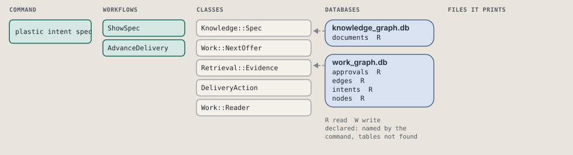
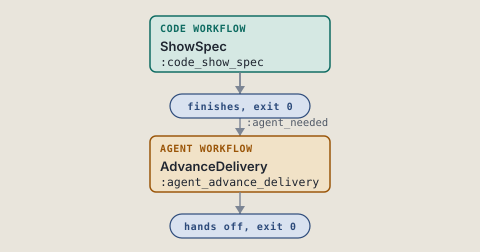
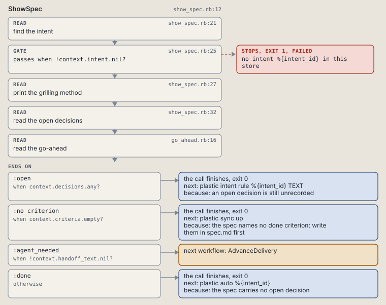
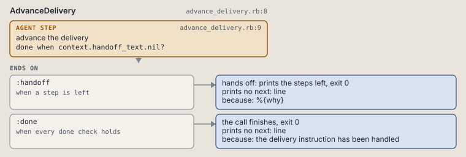

# plastic intent spec

Print the grilling method, then the intent's open decisions.

Prints the grilling method, then one intent's open decisions.

```sh
plastic intent spec ID
```

The command is `IntentSpec`, in [`intent_spec.rb:8`](../../../../scripts/lib/plastic/commands/intent_spec.rb#L8). The words on this page, such as gate, step and outcome, are explained in [the command DSL](../../dsl/README.md).

| Argument or option | What it gives | Default |
| --- | --- | --- |
| `ID` | the intent | |

## What it touches



## How the call flows



| Workflow | Kind | Code |
| --- | --- | --- |
| [ShowSpec](#showspec) | code | [`show_spec.rb:12`](../../../../scripts/lib/plastic/workflows/show_spec.rb#L12) |
| [AdvanceDelivery](#advancedelivery) | agent | [`advance_delivery.rb:8`](../../../../scripts/lib/plastic/workflows/advance_delivery.rb#L8) |

### ShowSpec

The code workflow `:code_show_spec`, in [`show_spec.rb:12`](../../../../scripts/lib/plastic/workflows/show_spec.rb#L12).

Prints the grilling method, then the intent's open decisions; refuses an unknown id.



| Step | Kind | Check | Code |
| --- | --- | --- | --- |
| find the intent | read |  | [`show_spec.rb:21`](../../../../scripts/lib/plastic/workflows/show_spec.rb#L21) |
| no intent %{intent_id} in this store | gate, stops with exit 1 | `!context.intent.nil?` | [`show_spec.rb:25`](../../../../scripts/lib/plastic/workflows/show_spec.rb#L25) |
| print the grilling method | read |  | [`show_spec.rb:27`](../../../../scripts/lib/plastic/workflows/show_spec.rb#L27) |
| read the open decisions | read |  | [`show_spec.rb:32`](../../../../scripts/lib/plastic/workflows/show_spec.rb#L32) |
| read the go-ahead | read |  | [`go_ahead.rb:16`](../../../../scripts/lib/plastic/workflows/go_ahead.rb#L16) |

| Outcome | When | Then | Code |
| --- | --- | --- | --- |
| `:open` | when `context.decisions.any?` | finishes, exit 0; next: plastic intent rule %{intent_id} TEXT | [`show_spec.rb:41`](../../../../scripts/lib/plastic/workflows/show_spec.rb#L41) |
| `:no_criterion` | when `context.criteria.empty?` | finishes, exit 0; next: plastic sync up | [`show_spec.rb:43`](../../../../scripts/lib/plastic/workflows/show_spec.rb#L43) |
| `:agent_needed` | when `!context.handoff_text.nil?` | runs [AdvanceDelivery](#advancedelivery) | [`show_spec.rb:45`](../../../../scripts/lib/plastic/workflows/show_spec.rb#L45) |
| `:done` | otherwise | finishes, exit 0; next: plastic auto %{intent_id} | [`show_spec.rb:46`](../../../../scripts/lib/plastic/workflows/show_spec.rb#L46) |

It sets `intent`, `decisions`, `criteria`, `why`, `handoff_text`.

### AdvanceDelivery

The agent workflow `:agent_advance_delivery`, in [`advance_delivery.rb:8`](../../../../scripts/lib/plastic/workflows/advance_delivery.rb#L8).

The harness performs judgment and records the result through commands.



| Step | Kind | Check | Code |
| --- | --- | --- | --- |
| advance the delivery | agent step | `context.handoff_text.nil?` | [`advance_delivery.rb:9`](../../../../scripts/lib/plastic/workflows/advance_delivery.rb#L9) |

| Outcome | When | Then | Code |
| --- | --- | --- | --- |
| `:handoff` | when a step is left | hands off, exit 0; prints no next: line | [`advance_delivery.rb:10`](../../../../scripts/lib/plastic/workflows/advance_delivery.rb#L10) |
| `:done` | when every done check holds | finishes, exit 0; prints no next: line | [`advance_delivery.rb:11`](../../../../scripts/lib/plastic/workflows/advance_delivery.rb#L11) |

The agent step "advance the delivery" prints:

> %{handoff_text}

## Outcomes

Every call can also end in [the ways any call can end](../../dsl/README.md#how-any-call-can-end).

| Ending | Exit | next: | Code |
| --- | --- | --- | --- |
| no intent %{intent_id} in this store | 1 | prints no next: line | [`show_spec.rb:25`](../../../../scripts/lib/plastic/workflows/show_spec.rb#L25) |
| an open decision is still unrecorded | 0 | plastic intent rule %{intent_id} TEXT | [`show_spec.rb:41`](../../../../scripts/lib/plastic/workflows/show_spec.rb#L41) |
| the spec names no done criterion; write them in spec.md first | 0 | plastic sync up | [`show_spec.rb:43`](../../../../scripts/lib/plastic/workflows/show_spec.rb#L43) |
| the spec carries no open decision | 0 | plastic auto %{intent_id} | [`show_spec.rb:46`](../../../../scripts/lib/plastic/workflows/show_spec.rb#L46) |
| %{why} | 0 | prints no next: line | [`advance_delivery.rb:10`](../../../../scripts/lib/plastic/workflows/advance_delivery.rb#L10) |
| the delivery instruction has been handled | 0 | prints no next: line | [`advance_delivery.rb:11`](../../../../scripts/lib/plastic/workflows/advance_delivery.rb#L11) |
| a step raises | 1 | prints no next: line | [`code_workflow.rb:97`](../../../../scripts/lib/plastic/code_workflow.rb#L97) |
