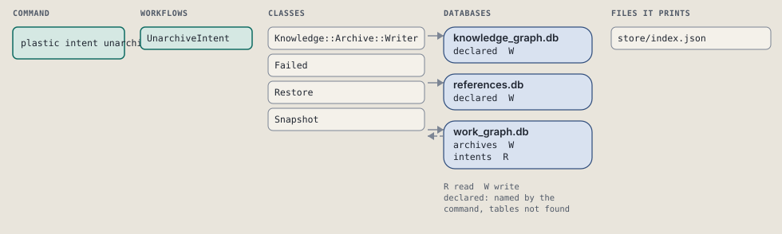
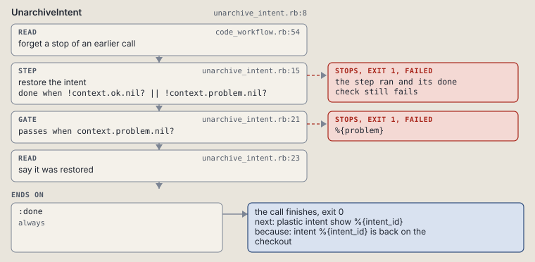

# plastic intent unarchive

Restore an archived intent's directory exactly as it was archived.

```sh
plastic intent unarchive ID [--dry-run]
```

The command is `IntentUnarchive`, in [`intent_unarchive.rb:8`](../../../../scripts/lib/plastic/commands/intent_unarchive.rb#L8). The words on this page, such as gate, step and outcome, are explained in [the command DSL](../../dsl/README.md).

| Argument or option | What it gives | Default |
| --- | --- | --- |
| `ID` | the archived intent to restore | |
| `--dry-run` | preview the call in a disposable copy | `false` |

## What it touches



## How the call flows


| Workflow | Kind | Code |
| --- | --- | --- |
| [UnarchiveIntent](#unarchiveintent) | code | [`unarchive_intent.rb:8`](../../../../scripts/lib/plastic/workflows/unarchive_intent.rb#L8) |

### UnarchiveIntent

The code workflow `:code_unarchive_intent`, in [`unarchive_intent.rb:8`](../../../../scripts/lib/plastic/workflows/unarchive_intent.rb#L8).

Restores the archived directory snapshot, including bytes and metadata.



| Step | Kind | Check | Code |
| --- | --- | --- | --- |
| forget a stop of an earlier call | read |  | [`code_workflow.rb:49`](../../../../scripts/lib/plastic/code_workflow.rb#L49) |
| restore the intent | step | `!context.ok.nil? \|\| !context.problem.nil?` | [`unarchive_intent.rb:15`](../../../../scripts/lib/plastic/workflows/unarchive_intent.rb#L15) |
| %{problem} | gate, stops with exit 1 | `context.problem.nil?` | [`unarchive_intent.rb:21`](../../../../scripts/lib/plastic/workflows/unarchive_intent.rb#L21) |
| say it was restored | read |  | [`unarchive_intent.rb:23`](../../../../scripts/lib/plastic/workflows/unarchive_intent.rb#L23) |

| Outcome | When | Then | Code |
| --- | --- | --- | --- |
| `:done` | always | finishes, exit 0; next: plastic intent show %{intent_id} | [`unarchive_intent.rb:27`](../../../../scripts/lib/plastic/workflows/unarchive_intent.rb#L27) |

It sets `problem`, `ok`.

## Outcomes

Every call can also end in [the ways any call can end](../../dsl/README.md#how-any-call-can-end).

| Ending | Exit | next: | Code |
| --- | --- | --- | --- |
| %{problem} | 1 | prints no next: line | [`unarchive_intent.rb:21`](../../../../scripts/lib/plastic/workflows/unarchive_intent.rb#L21) |
| intent %{intent_id} is back on the checkout | 0 | plastic intent show %{intent_id} | [`unarchive_intent.rb:27`](../../../../scripts/lib/plastic/workflows/unarchive_intent.rb#L27) |
| a step raises | 1 | prints no next: line | [`code_workflow.rb:97`](../../../../scripts/lib/plastic/code_workflow.rb#L97) |
