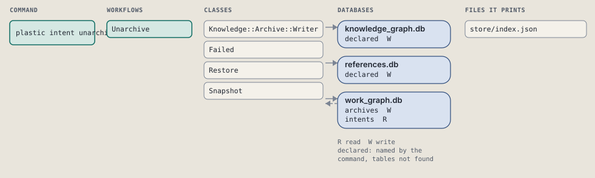
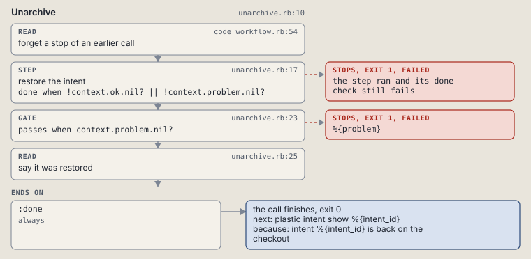
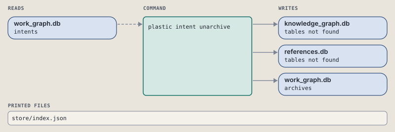

# plastic intent unarchive

Restore an archived intent's directory exactly as it was archived.

```sh
plastic intent unarchive ID [--dry-run]
```

The command is `Intent::Unarchive`, in [`unarchive.rb:9`](../../../../lib/plastic/commands/intent/unarchive.rb#L9). The words on this page, such as gate, step and outcome, are explained in [the command DSL](../../dsl/README.md).

| Argument or option | What it gives | Default |
| --- | --- | --- |
| `ID` | the archived intent to restore | |
| `--dry-run` | preview the call in a disposable copy | `false` |

## Components



The figure shows the command, the workflows it runs, the classes behind them, and the databases and files they reach.

## The events of one call

The call starts the workflow `Code::Intent::Unarchive`, in [`unarchive.rb:10`](../../../../lib/plastic/workflows/code/intent/unarchive.rb#L10).

Restores the archived directory snapshot, including bytes and metadata.



Its rows run in this order:

1. Read: forget a stop of an earlier call. [`code_workflow.rb:54`](../../../../lib/plastic/code_workflow.rb#L54)
2. Step: restore the intent. Done when `!context.ok.nil? || !context.problem.nil?`, so a second call skips it. [`unarchive.rb:17`](../../../../lib/plastic/workflows/code/intent/unarchive.rb#L17)
3. Gate: passes when `context.problem.nil?`; otherwise the call stops with exit 1 and prints PROBLEM. [`unarchive.rb:23`](../../../../lib/plastic/workflows/code/intent/unarchive.rb#L23)
4. Read: say it was restored. [`unarchive.rb:25`](../../../../lib/plastic/workflows/code/intent/unarchive.rb#L25)
5. Outcome `:done`, always: finishes with exit 0; next: plastic intent show INTENT_ID. [`unarchive.rb:29`](../../../../lib/plastic/workflows/code/intent/unarchive.rb#L29)

It sets `problem`, `ok`.

In the words of workflow engines, the rows are these four parts:

- **Trigger**: the call starts the workflow `Code::Intent::Unarchive`.
- **Activities**: 2 reads and 1 step.
- **Transitions**: 1 gate stops the call when its check fails; a step runs only while its done check fails.
- **Outcomes**: `:done` end the call.

## What one call reads, writes and prints



| Place | Database or file | Tables | Reads or writes | Code |
| --- | --- | --- | --- | --- |
| the store folder | knowledge_graph.db | not found in the code | writes | [`unarchive.rb:12`](../../../../lib/plastic/commands/intent/unarchive.rb#L12) |
| the store folder | references.db | not found in the code | writes | [`unarchive.rb:12`](../../../../lib/plastic/commands/intent/unarchive.rb#L12) |
| the store folder | work_graph.db | `archives`, `intents` | reads and writes | [`unarchive.rb:12`](../../../../lib/plastic/commands/intent/unarchive.rb#L12) |
| the store folder | store/index.json | | writes | [`prints.rb:14`](../../../../lib/plastic/graph/prints.rb#L14) |

A second call runs the same rows again. A step runs again only when its done check fails.

| Step | Done when | The second call | Code |
| --- | --- | --- | --- |
| restore the intent | `!context.ok.nil? \|\| !context.problem.nil?` | skips it | [`unarchive.rb:17`](../../../../lib/plastic/workflows/code/intent/unarchive.rb#L17) |

## How a call ends

Every call can also end in [the ways any call can end](../../dsl/README.md#how-any-call-can-end).

| Ending | Exit | next: | Code |
| --- | --- | --- | --- |
| PROBLEM | 1 | prints no next: line | [`unarchive.rb:23`](../../../../lib/plastic/workflows/code/intent/unarchive.rb#L23) |
| intent INTENT_ID is back on the checkout | 0 | plastic intent show INTENT_ID | [`unarchive.rb:29`](../../../../lib/plastic/workflows/code/intent/unarchive.rb#L29) |
| a step raises | 1 | prints no next: line | [`code_workflow.rb:102`](../../../../lib/plastic/code_workflow.rb#L102) |

## What the page leaves out

Every call shares a few things that this page does not repeat; [the command DSL](../../dsl/README.md#what-every-call-shares) names them.

- A call that writes saves a routine run row in local.db. A stop by a gate or a step saves the run, and the next call resumes from it. A dry run saves no row.
