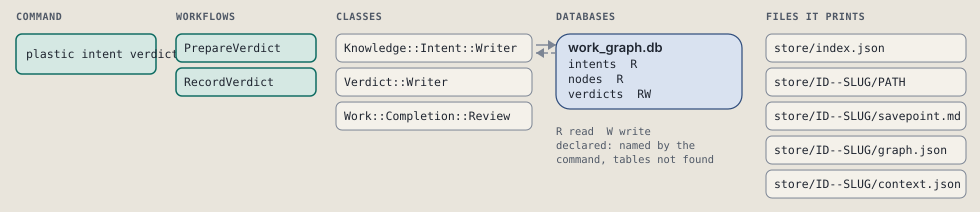
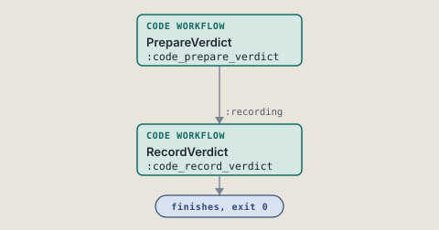
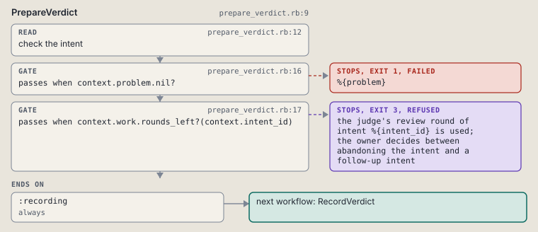
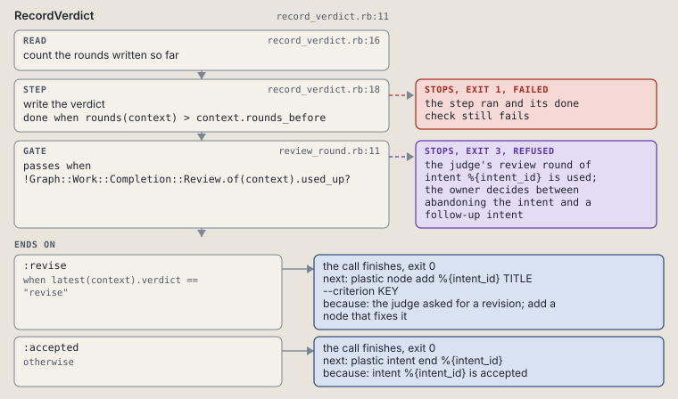

# plastic intent verdict

Record the verdict of the next review round of an intent.

```sh
plastic intent verdict ID accept|revise TEXT
```

The command is `IntentVerdict`, in [`intent_verdict.rb:8`](../../../../scripts/lib/plastic/commands/intent_verdict.rb#L8). The words on this page, such as gate, step and outcome, are explained in [the command DSL](../../dsl/README.md).

| Argument or option | What it gives | Default |
| --- | --- | --- |
| `ID` | the intent | |
| `accept|revise` | the verdict of this review round | |
| `TEXT` | what the review showed | |

## What it touches



## Before the chain

The command's own `call`, at [`intent_verdict.rb:22`](../../../../scripts/lib/plastic/commands/intent_verdict.rb#L22), runs first:

```ruby
def call(*)
  raise CLI::Command::Usage, "the verdict takes accept or revise" unless VERDICTS.include?(parsed[:verdict])

  super
end
```

## How the call flows



| Workflow | Kind | Code |
| --- | --- | --- |
| [PrepareVerdict](#prepareverdict) | code | [`prepare_verdict.rb:9`](../../../../scripts/lib/plastic/workflows/prepare_verdict.rb#L9) |
| [RecordVerdict](#recordverdict) | code | [`record_verdict.rb:11`](../../../../scripts/lib/plastic/workflows/record_verdict.rb#L11) |

### PrepareVerdict

The code workflow `:code_prepare_verdict`, in [`prepare_verdict.rb:9`](../../../../scripts/lib/plastic/workflows/prepare_verdict.rb#L9).

Reads the intent and its judge rounds before a verdict is written: a missing or closed intent fails, both rounds used is the owner's step.



| Step | Kind | Check | Code |
| --- | --- | --- | --- |
| check the intent | read |  | [`prepare_verdict.rb:12`](../../../../scripts/lib/plastic/workflows/prepare_verdict.rb#L12) |
| %{problem} | gate, stops with exit 1 | `context.problem.nil?` | [`prepare_verdict.rb:16`](../../../../scripts/lib/plastic/workflows/prepare_verdict.rb#L16) |
| the judge's review round of intent %{intent_id} is used; the owner decides between abandoning the intent and a follow-up intent | gate, stops with exit 3 | `context.work.rounds_left?(context.intent_id)` | [`prepare_verdict.rb:17`](../../../../scripts/lib/plastic/workflows/prepare_verdict.rb#L17) |

| Outcome | When | Then | Code |
| --- | --- | --- | --- |
| `:recording` | always | runs [RecordVerdict](#recordverdict) | [`prepare_verdict.rb:20`](../../../../scripts/lib/plastic/workflows/prepare_verdict.rb#L20) |

It sets `problem`.

### RecordVerdict

The code workflow `:code_record_verdict`, in [`record_verdict.rb:11`](../../../../scripts/lib/plastic/workflows/record_verdict.rb#L11).

Writes the verdict row of the next review round. A second revise ends the call as the owner's step.



| Step | Kind | Check | Code |
| --- | --- | --- | --- |
| count the rounds written so far | read |  | [`record_verdict.rb:16`](../../../../scripts/lib/plastic/workflows/record_verdict.rb#L16) |
| write the verdict | step | `rounds(context) > context.rounds_before` | [`record_verdict.rb:18`](../../../../scripts/lib/plastic/workflows/record_verdict.rb#L18) |
| the judge's review round of intent %{intent_id} is used; the owner decides between abandoning the intent and a follow-up intent | gate, stops with exit 3 | `!Graph::Work::Completion::Review.of(context).used_up?` | [`review_round.rb:11`](../../../../scripts/lib/plastic/workflows/review_round.rb#L11) |

| Outcome | When | Then | Code |
| --- | --- | --- | --- |
| `:revise` | when `latest(context).verdict == "revise"` | finishes, exit 0; next: plastic node add %{intent_id} TITLE --criterion KEY | [`record_verdict.rb:29`](../../../../scripts/lib/plastic/workflows/record_verdict.rb#L29) |
| `:accepted` | otherwise | finishes, exit 0; next: plastic intent end %{intent_id} | [`record_verdict.rb:31`](../../../../scripts/lib/plastic/workflows/record_verdict.rb#L31) |

It sets `rounds_before`.

## Outcomes

Every call can also end in [the ways any call can end](../../dsl/README.md#how-any-call-can-end).

| Ending | Exit | next: | Code |
| --- | --- | --- | --- |
| %{problem} | 1 | prints no next: line | [`prepare_verdict.rb:16`](../../../../scripts/lib/plastic/workflows/prepare_verdict.rb#L16) |
| the judge's review round of intent %{intent_id} is used; the owner decides between abandoning the intent and a follow-up intent | 3 | prints no next: line | [`prepare_verdict.rb:17`](../../../../scripts/lib/plastic/workflows/prepare_verdict.rb#L17) |
| the judge's review round of intent %{intent_id} is used; the owner decides between abandoning the intent and a follow-up intent | 3 | prints no next: line | [`review_round.rb:11`](../../../../scripts/lib/plastic/workflows/review_round.rb#L11) |
| the judge asked for a revision; add a node that fixes it | 0 | plastic node add %{intent_id} TITLE --criterion KEY | [`record_verdict.rb:29`](../../../../scripts/lib/plastic/workflows/record_verdict.rb#L29) |
| intent %{intent_id} is accepted | 0 | plastic intent end %{intent_id} | [`record_verdict.rb:31`](../../../../scripts/lib/plastic/workflows/record_verdict.rb#L31) |
| a step raises | 1 | prints no next: line | [`code_workflow.rb:97`](../../../../scripts/lib/plastic/code_workflow.rb#L97) |
| Usage error: the verdict takes accept or revise | 2 | prints no next: line | [`intent_verdict.rb:23`](../../../../scripts/lib/plastic/commands/intent_verdict.rb#L23) |
