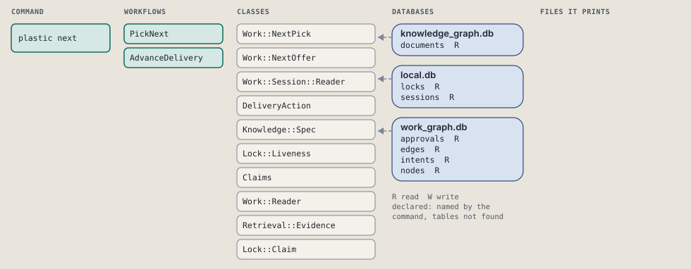
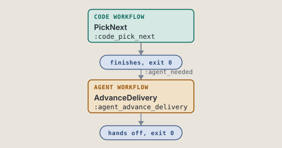
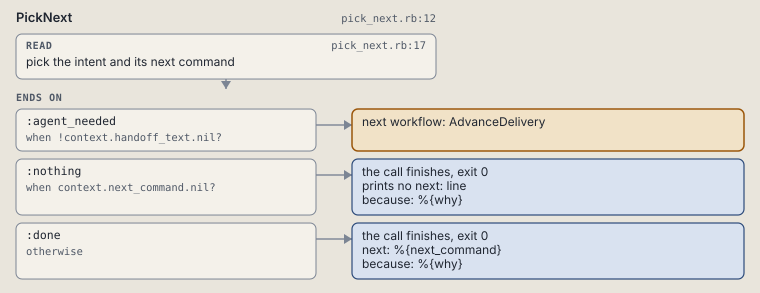
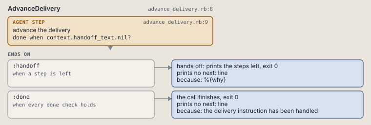

# plastic next

Pick the intent in play and offer its next command.

```sh
plastic next
```

The command is `Next`, in [`next.rb:8`](../../../../scripts/lib/plastic/commands/next.rb#L8). The words on this page, such as gate, step and outcome, are explained in [the command DSL](../../dsl/README.md).

## What it touches



## How the call flows



| Workflow | Kind | Code |
| --- | --- | --- |
| [PickNext](#picknext) | code | [`pick_next.rb:12`](../../../../scripts/lib/plastic/workflows/pick_next.rb#L12) |
| [AdvanceDelivery](#advancedelivery) | agent | [`advance_delivery.rb:8`](../../../../scripts/lib/plastic/workflows/advance_delivery.rb#L8) |

### PickNext

The code workflow `:code_pick_next`, in [`pick_next.rb:12`](../../../../scripts/lib/plastic/workflows/pick_next.rb#L12).

Picks the intent this session is working on and offers its next command: the spec, the start, the brief, a failed node, the check or the ready list. Several candidates offer status; none offers a new intent.



| Step | Kind | Check | Code |
| --- | --- | --- | --- |
| pick the intent and its next command | read |  | [`pick_next.rb:17`](../../../../scripts/lib/plastic/workflows/pick_next.rb#L17) |

| Outcome | When | Then | Code |
| --- | --- | --- | --- |
| `:agent_needed` | when `!context.handoff_text.nil?` | runs [AdvanceDelivery](#advancedelivery) | [`pick_next.rb:22`](../../../../scripts/lib/plastic/workflows/pick_next.rb#L22) |
| `:nothing` | when `context.next_command.nil?` | finishes, exit 0; prints no next: line | [`pick_next.rb:23`](../../../../scripts/lib/plastic/workflows/pick_next.rb#L23) |
| `:done` | otherwise | finishes, exit 0; next: %{next_command} | [`pick_next.rb:24`](../../../../scripts/lib/plastic/workflows/pick_next.rb#L24) |

It sets `next_command`, `why`, `handoff_text`.

### AdvanceDelivery

The agent workflow `:agent_advance_delivery`, in [`advance_delivery.rb:8`](../../../../scripts/lib/plastic/workflows/advance_delivery.rb#L8).

The harness performs judgment and records the result through commands.



| Step | Kind | Check | Code |
| --- | --- | --- | --- |
| advance the delivery | agent step | `context.handoff_text.nil?` | [`advance_delivery.rb:9`](../../../../scripts/lib/plastic/workflows/advance_delivery.rb#L9) |

| Outcome | When | Then | Code |
| --- | --- | --- | --- |
| `:handoff` | when a step is left | hands off, exit 0; prints no next: line | [`advance_delivery.rb:10`](../../../../scripts/lib/plastic/workflows/advance_delivery.rb#L10) |
| `:done` | when every done check holds | finishes, exit 0; prints no next: line | [`advance_delivery.rb:11`](../../../../scripts/lib/plastic/workflows/advance_delivery.rb#L11) |

The agent step "advance the delivery" prints:

> %{handoff_text}

## Outcomes

Every call can also end in [the ways any call can end](../../dsl/README.md#how-any-call-can-end).

| Ending | Exit | next: | Code |
| --- | --- | --- | --- |
| %{why} | 0 | prints no next: line | [`pick_next.rb:23`](../../../../scripts/lib/plastic/workflows/pick_next.rb#L23) |
| %{why} | 0 | %{next_command} | [`pick_next.rb:24`](../../../../scripts/lib/plastic/workflows/pick_next.rb#L24) |
| %{why} | 0 | prints no next: line | [`advance_delivery.rb:10`](../../../../scripts/lib/plastic/workflows/advance_delivery.rb#L10) |
| the delivery instruction has been handled | 0 | prints no next: line | [`advance_delivery.rb:11`](../../../../scripts/lib/plastic/workflows/advance_delivery.rb#L11) |
| a step raises | 1 | prints no next: line | [`code_workflow.rb:97`](../../../../scripts/lib/plastic/code_workflow.rb#L97) |
