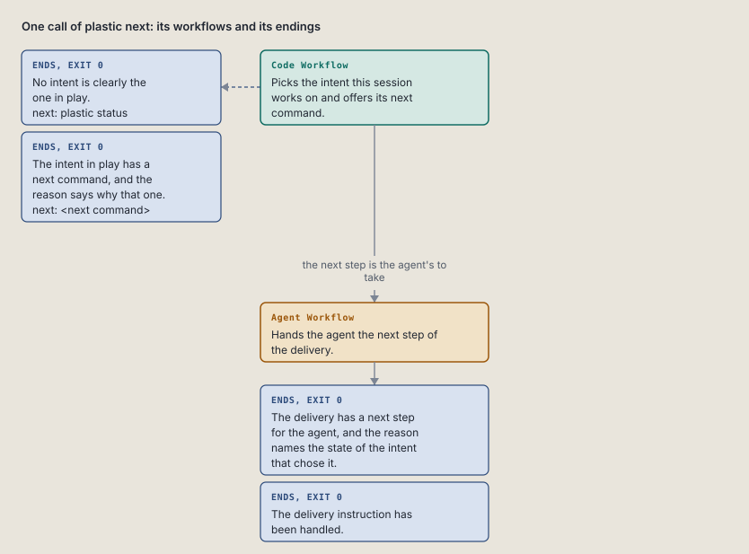
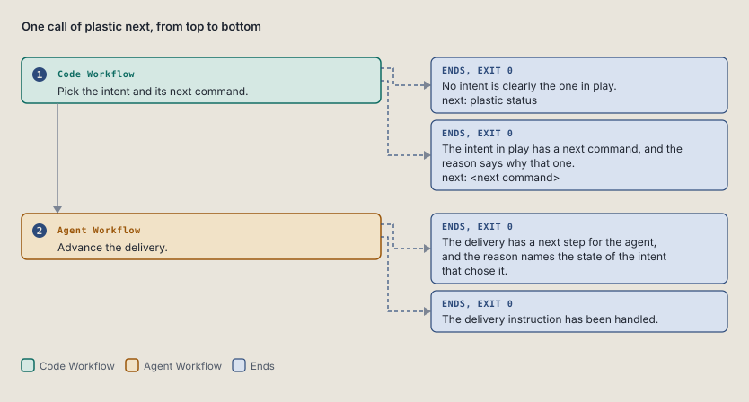

# plastic next

Pick the intent in play and offer its next command.

```sh
plastic next
```

## The workflows of one call



Each box is a workflow. The words between the boxes say when the call moves on, and the last boxes say how the call ends.

## The events of one call, step by step



The boxes on the left run in order. The boxes on the right are the ways the call stops or ends at that step.

## What one call changes

This command changes nothing.

## What the agent workflow steps print

| Step | The text the agent gets |
| --- | --- |
| 2 | The instruction for the next step of the delivery: the owner's go-ahead while none is recorded, then the step the state of the intent calls for |

The command is `Plastic::Commands::Next`, in [`next.rb:8`](../../../../lib/plastic/commands/next.rb#L8).
