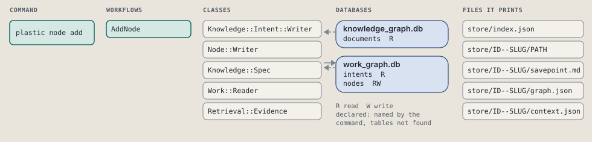
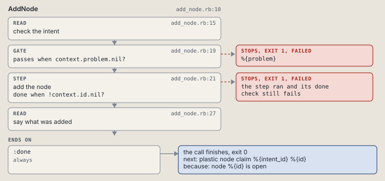

# plastic node add

Add a node to an intent's work graph.

```sh
plastic node add ID TITLE --criterion KEY [--input PATH]
```

The command is `NodeAdd`, in [`node_add.rb:8`](../../../../scripts/lib/plastic/commands/node_add.rb#L8). The words on this page, such as gate, step and outcome, are explained in [the command DSL](../../dsl/README.md).

| Argument or option | What it gives | Default |
| --- | --- | --- |
| `ID` | the intent | |
| `TITLE` | what the node is for | |
| `--criterion KEY` | the key of the spec done criterion this node serves |  |
| `--input PATH` | a file the node reads |  |

## What it touches



## How the call flows


| Workflow | Kind | Code |
| --- | --- | --- |
| [AddNode](#addnode) | code | [`add_node.rb:10`](../../../../scripts/lib/plastic/workflows/add_node.rb#L10) |

### AddNode

The code workflow `:code_add_node`, in [`add_node.rb:10`](../../../../scripts/lib/plastic/workflows/add_node.rb#L10).

Writes a new node, open and ready, unless the intent is done or abandoned.



| Step | Kind | Check | Code |
| --- | --- | --- | --- |
| check the intent | read |  | [`add_node.rb:15`](../../../../scripts/lib/plastic/workflows/add_node.rb#L15) |
| %{problem} | gate, stops with exit 1 | `context.problem.nil?` | [`add_node.rb:19`](../../../../scripts/lib/plastic/workflows/add_node.rb#L19) |
| add the node | step | `!context.id.nil?` | [`add_node.rb:21`](../../../../scripts/lib/plastic/workflows/add_node.rb#L21) |
| say what was added | read |  | [`add_node.rb:27`](../../../../scripts/lib/plastic/workflows/add_node.rb#L27) |

| Outcome | When | Then | Code |
| --- | --- | --- | --- |
| `:done` | always | finishes, exit 0; next: plastic node claim %{intent_id} %{id} | [`add_node.rb:43`](../../../../scripts/lib/plastic/workflows/add_node.rb#L43) |

It sets `problem`, `id`.

## Outcomes

Every call can also end in [the ways any call can end](../../dsl/README.md#how-any-call-can-end).

| Ending | Exit | next: | Code |
| --- | --- | --- | --- |
| %{problem} | 1 | prints no next: line | [`add_node.rb:19`](../../../../scripts/lib/plastic/workflows/add_node.rb#L19) |
| node %{id} is open | 0 | plastic node claim %{intent_id} %{id} | [`add_node.rb:43`](../../../../scripts/lib/plastic/workflows/add_node.rb#L43) |
| a step raises | 1 | prints no next: line | [`code_workflow.rb:102`](../../../../scripts/lib/plastic/code_workflow.rb#L102) |
