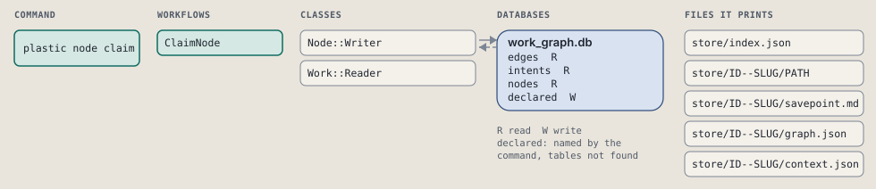
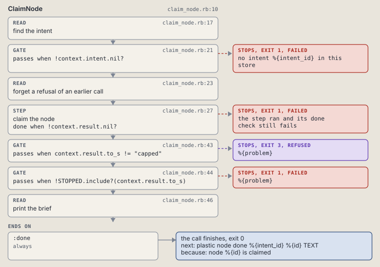

# plastic node claim

Claim an open node and print its brief.

Claims an open node: moves it to claimed and prints its brief.

```sh
plastic node claim ID NODE
```

The command is `NodeClaim`, in [`node_claim.rb:8`](../../../../scripts/lib/plastic/commands/node_claim.rb#L8). The words on this page, such as gate, step and outcome, are explained in [the command DSL](../../dsl/README.md).

| Argument or option | What it gives | Default |
| --- | --- | --- |
| `ID` | the intent | |
| `NODE` | the node | |

## What it touches



## How the call flows


| Workflow | Kind | Code |
| --- | --- | --- |
| [ClaimNode](#claimnode) | code | [`claim_node.rb:10`](../../../../scripts/lib/plastic/workflows/claim_node.rb#L10) |

### ClaimNode

The code workflow `:code_claim_node`, in [`claim_node.rb:10`](../../../../scripts/lib/plastic/workflows/claim_node.rb#L10).

Claims an open node whose needed nodes are done. The fourth claim of a node moves to needs_info instead, with the owner's question, and refuses. A refused claim keeps its routine run open, so the next call claims again.



| Step | Kind | Check | Code |
| --- | --- | --- | --- |
| find the intent | read |  | [`claim_node.rb:17`](../../../../scripts/lib/plastic/workflows/claim_node.rb#L17) |
| no intent %{intent_id} in this store | gate, stops with exit 1 | `!context.intent.nil?` | [`claim_node.rb:21`](../../../../scripts/lib/plastic/workflows/claim_node.rb#L21) |
| forget a refusal of an earlier call | read |  | [`claim_node.rb:23`](../../../../scripts/lib/plastic/workflows/claim_node.rb#L23) |
| claim the node | step | `!context.result.nil?` | [`claim_node.rb:27`](../../../../scripts/lib/plastic/workflows/claim_node.rb#L27) |
| %{problem} | gate, stops with exit 3 | `context.result.to_s != "capped"` | [`claim_node.rb:43`](../../../../scripts/lib/plastic/workflows/claim_node.rb#L43) |
| %{problem} | gate, stops with exit 1 | `!STOPPED.include?(context.result.to_s)` | [`claim_node.rb:44`](../../../../scripts/lib/plastic/workflows/claim_node.rb#L44) |
| print the brief | read |  | [`claim_node.rb:46`](../../../../scripts/lib/plastic/workflows/claim_node.rb#L46) |

| Outcome | When | Then | Code |
| --- | --- | --- | --- |
| `:done` | always | finishes, exit 0; next: plastic node done %{intent_id} %{id} TEXT | [`claim_node.rb:54`](../../../../scripts/lib/plastic/workflows/claim_node.rb#L54) |

It sets `intent`, `result`, `node`, `problem`.

## Outcomes

Every call can also end in [the ways any call can end](../../dsl/README.md#how-any-call-can-end).

| Ending | Exit | next: | Code |
| --- | --- | --- | --- |
| no intent %{intent_id} in this store | 1 | prints no next: line | [`claim_node.rb:21`](../../../../scripts/lib/plastic/workflows/claim_node.rb#L21) |
| %{problem} | 3 | prints no next: line | [`claim_node.rb:43`](../../../../scripts/lib/plastic/workflows/claim_node.rb#L43) |
| %{problem} | 1 | prints no next: line | [`claim_node.rb:44`](../../../../scripts/lib/plastic/workflows/claim_node.rb#L44) |
| node %{id} is claimed | 0 | plastic node done %{intent_id} %{id} TEXT | [`claim_node.rb:54`](../../../../scripts/lib/plastic/workflows/claim_node.rb#L54) |
| a step raises | 1 | prints no next: line | [`code_workflow.rb:97`](../../../../scripts/lib/plastic/code_workflow.rb#L97) |
