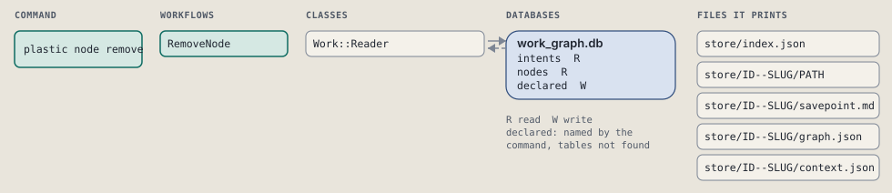
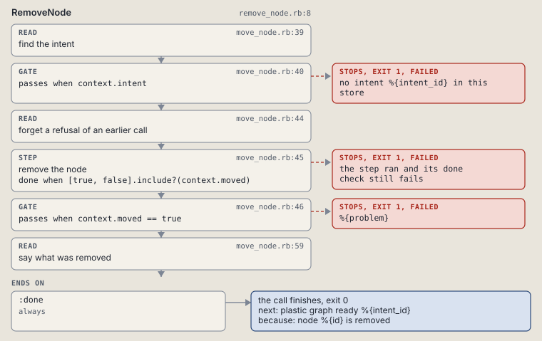

# plastic node remove

Remove a node; its edges stay as rows.

Moves a node from open to removed. Its edges stay, but a removed node never counts as ready or isolated.

```sh
plastic node remove ID NODE [--reason TEXT] [--dry-run]
```

The command is `NodeRemove`, in [`node_remove.rb:9`](../../../../scripts/lib/plastic/commands/node_remove.rb#L9). The words on this page, such as gate, step and outcome, are explained in [the command DSL](../../dsl/README.md).

| Argument or option | What it gives | Default |
| --- | --- | --- |
| `ID` | the intent | |
| `NODE` | the node | |
| `--reason TEXT` | why the node is removed |  |
| `--dry-run` | preview the call in a disposable copy | `false` |

## What it touches



## How the call flows


| Workflow | Kind | Code |
| --- | --- | --- |
| [RemoveNode](#removenode) | code | [`remove_node.rb:8`](../../../../scripts/lib/plastic/workflows/remove_node.rb#L8) |

### RemoveNode

The code workflow `:code_remove_node`, in [`remove_node.rb:8`](../../../../scripts/lib/plastic/workflows/remove_node.rb#L8).

Moves a node from open to removed.



| Step | Kind | Check | Code |
| --- | --- | --- | --- |
| find the intent | read |  | [`move_node.rb:39`](../../../../scripts/lib/plastic/workflows/move_node.rb#L39) |
| no intent %{intent_id} in this store | gate, stops with exit 1 | `context.intent` | [`move_node.rb:40`](../../../../scripts/lib/plastic/workflows/move_node.rb#L40) |
| forget a refusal of an earlier call | read |  | [`move_node.rb:44`](../../../../scripts/lib/plastic/workflows/move_node.rb#L44) |
| remove the node | step | `[true, false].include?(context.moved)` | [`move_node.rb:45`](../../../../scripts/lib/plastic/workflows/move_node.rb#L45) |
| %{problem} | gate, stops with exit 1 | `context.moved == true` | [`move_node.rb:46`](../../../../scripts/lib/plastic/workflows/move_node.rb#L46) |
| say what was removed | read |  | [`move_node.rb:59`](../../../../scripts/lib/plastic/workflows/move_node.rb#L59) |

| Outcome | When | Then | Code |
| --- | --- | --- | --- |
| `:done` | always | finishes, exit 0; next: plastic graph ready %{intent_id} | [`move_node.rb:60`](../../../../scripts/lib/plastic/workflows/move_node.rb#L60) |

It sets `intent`, `problem`, `moved`.

## Outcomes

Every call can also end in [the ways any call can end](../../dsl/README.md#how-any-call-can-end).

| Ending | Exit | next: | Code |
| --- | --- | --- | --- |
| no intent %{intent_id} in this store | 1 | prints no next: line | [`move_node.rb:40`](../../../../scripts/lib/plastic/workflows/move_node.rb#L40) |
| %{problem} | 1 | prints no next: line | [`move_node.rb:46`](../../../../scripts/lib/plastic/workflows/move_node.rb#L46) |
| node %{id} is removed | 0 | plastic graph ready %{intent_id} | [`move_node.rb:60`](../../../../scripts/lib/plastic/workflows/move_node.rb#L60) |
| a step raises | 1 | prints no next: line | [`code_workflow.rb:97`](../../../../scripts/lib/plastic/code_workflow.rb#L97) |
