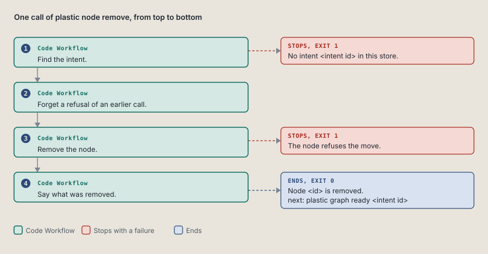

# plastic node remove

Remove a node; its edges stay as rows.

```sh
plastic node remove ID NODE [--reason TEXT] [--dry-run]
```

| Argument or option | What it gives | Default |
| --- | --- | --- |
| `ID` | the intent | |
| `NODE` | the node | |
| `--reason TEXT` | why the node is removed |  |
| `--dry-run` | preview the call in a disposable copy | `false` |

## The events of one call, step by step



The boxes on the left run in order. The boxes on the right are the ways the call stops or ends at that step.

## What one call changes

| What changes | Where | Reach |
| --- | --- | --- |
| The node is removed from the work graph with the reason | the work graph database, in the store folder | goes with the store |
| The files of the intent and the index of the store are rewritten | the store folder | goes with the store |

Goes with the store: the files of the store carry the change, and `plastic sync up` rebuilds it on another machine. The database files themselves stay on this machine.

The command is `Plastic::Commands::Node::Remove`, in [`commands/node/remove.rb`](../../../../lib/plastic/commands/node/remove.rb).
