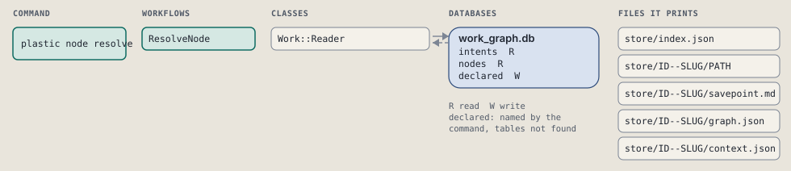
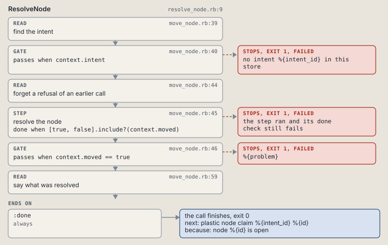

# plastic node resolve

Reopen a needs_info or impeded node with its resolution.

```sh
plastic node resolve ID NODE TEXT
```

The command is `NodeResolve`, in [`node_resolve.rb:9`](../../../../scripts/lib/plastic/commands/node_resolve.rb#L9). The words on this page, such as gate, step and outcome, are explained in [the command DSL](../../dsl/README.md).

| Argument or option | What it gives | Default |
| --- | --- | --- |
| `ID` | the intent | |
| `NODE` | the node | |
| `TEXT` | the resolution | |

## What it touches



## How the call flows


| Workflow | Kind | Code |
| --- | --- | --- |
| [ResolveNode](#resolvenode) | code | [`resolve_node.rb:9`](../../../../scripts/lib/plastic/workflows/resolve_node.rb#L9) |

### ResolveNode

The code workflow `:code_resolve_node`, in [`resolve_node.rb:9`](../../../../scripts/lib/plastic/workflows/resolve_node.rb#L9).

Reopens a needs_info or impeded node with its resolution and resets its retries.



| Step | Kind | Check | Code |
| --- | --- | --- | --- |
| find the intent | read |  | [`move_node.rb:39`](../../../../scripts/lib/plastic/workflows/move_node.rb#L39) |
| no intent %{intent_id} in this store | gate, stops with exit 1 | `context.intent` | [`move_node.rb:40`](../../../../scripts/lib/plastic/workflows/move_node.rb#L40) |
| forget a refusal of an earlier call | read |  | [`move_node.rb:44`](../../../../scripts/lib/plastic/workflows/move_node.rb#L44) |
| resolve the node | step | `[true, false].include?(context.moved)` | [`move_node.rb:45`](../../../../scripts/lib/plastic/workflows/move_node.rb#L45) |
| %{problem} | gate, stops with exit 1 | `context.moved == true` | [`move_node.rb:46`](../../../../scripts/lib/plastic/workflows/move_node.rb#L46) |
| say what was resolved | read |  | [`move_node.rb:59`](../../../../scripts/lib/plastic/workflows/move_node.rb#L59) |

| Outcome | When | Then | Code |
| --- | --- | --- | --- |
| `:done` | always | finishes, exit 0; next: plastic node claim %{intent_id} %{id} | [`move_node.rb:60`](../../../../scripts/lib/plastic/workflows/move_node.rb#L60) |

It sets `intent`, `problem`, `moved`.

## Outcomes

Every call can also end in [the ways any call can end](../../dsl/README.md#how-any-call-can-end).

| Ending | Exit | next: | Code |
| --- | --- | --- | --- |
| no intent %{intent_id} in this store | 1 | prints no next: line | [`move_node.rb:40`](../../../../scripts/lib/plastic/workflows/move_node.rb#L40) |
| %{problem} | 1 | prints no next: line | [`move_node.rb:46`](../../../../scripts/lib/plastic/workflows/move_node.rb#L46) |
| node %{id} is open | 0 | plastic node claim %{intent_id} %{id} | [`move_node.rb:60`](../../../../scripts/lib/plastic/workflows/move_node.rb#L60) |
| a step raises | 1 | prints no next: line | [`code_workflow.rb:97`](../../../../scripts/lib/plastic/code_workflow.rb#L97) |
