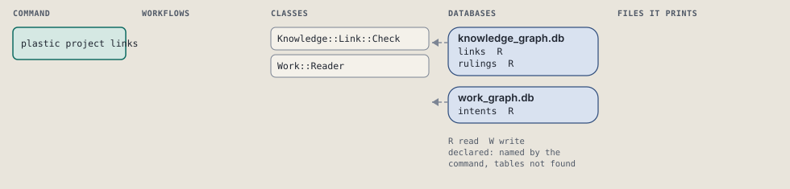
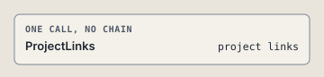

# plastic project links

List the links that name an intent or a ruling this store lacks.

Lists the links of the store whose local end names an intent or a ruling the store does not hold. It writes nothing; it prints the count when any link is broken.

```sh
plastic project links
```

The command is `ProjectLinks`, in [`project_links.rb:12`](../../../../scripts/lib/plastic/commands/project_links.rb#L12). The words on this page, such as gate, step and outcome, are explained in [the command DSL](../../dsl/README.md).

## What it touches



## Before the chain

The command's own `call`, at [`project_links.rb:15`](../../../../scripts/lib/plastic/commands/project_links.rb#L15), runs first:

```ruby
def call
  broken = broken_links
  broken.each { |link| output.raw("#{link.from_ref} #{link.kind} #{link.to_ref}") }
  output.raw(Graph::Knowledge::Link::Check.summary(broken.size)) if broken.any?
  output.next_step("plastic status", because: "every link names an intent or a ruling this store holds")
end
```

## How the call flows



## Outcomes

Every call can also end in [the ways any call can end](../../dsl/README.md#how-any-call-can-end).

| Ending | Exit | next: | Code |
| --- | --- | --- | --- |
| output.next_step("plastic status", because: "every link names an intent or a ruling this store holds") | 0 | plastic status | [`project_links.rb:19`](../../../../scripts/lib/plastic/commands/project_links.rb#L19) |
