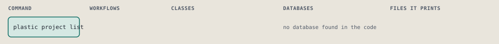
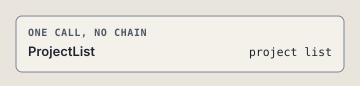

# plastic project list

List the registered projects with their paths.

Lists the projects of projects.yml, each with its path, and marks the ones whose store folder is missing. It writes nothing.

```sh
plastic project list
```

The command is `ProjectList`, in [`project_list.rb:9`](../../../../scripts/lib/plastic/commands/project_list.rb#L9). The words on this page, such as gate, step and outcome, are explained in [the command DSL](../../dsl/README.md).

## What it touches



## The command

The command's `call`, at [`project_list.rb:12`](../../../../scripts/lib/plastic/commands/project_list.rb#L12):

```ruby
def call
  projects = scope.projects
  projects.sort.each { |slug, path| output.row("project", "#{slug}: #{path}#{NO_STORE unless store?(slug)}") }
  return output.next_step("plastic project new SLUG PATH", because: "no project is registered yet") if projects.empty?

  output.next_step("plastic status", because: "the projects are listed")
end
```

## How the call flows



## Outcomes

Every call can also end in [the ways any call can end](../../dsl/README.md#how-any-call-can-end).

| Ending | Exit | next: | Code |
| --- | --- | --- | --- |
| Offers the next command | 0 | plastic project new SLUG PATH | [`project_list.rb:15`](../../../../scripts/lib/plastic/commands/project_list.rb#L15) |
| Offers the next command | 0 | plastic status | [`project_list.rb:17`](../../../../scripts/lib/plastic/commands/project_list.rb#L17) |
