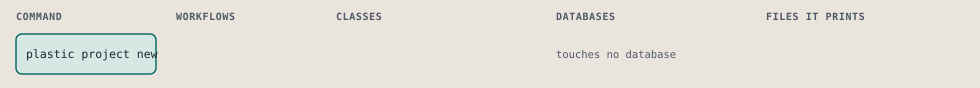
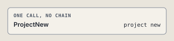

# plastic project new

Register a project and leave its store ready for intent new.

Registers a project in projects.yml and leaves its store ready, so an intent can be opened at once. The other lines of the file stay as they are. The same name at the same path again changes nothing.

```sh
plastic project new SLUG PATH
```

The command is `ProjectNew`, in [`project_new.rb:13`](../../../../scripts/lib/plastic/commands/project_new.rb#L13). The words on this page, such as gate, step and outcome, are explained in [the command DSL](../../dsl/README.md).

| Argument or option | What it gives | Default |
| --- | --- | --- |
| `SLUG` | the project's name: lowercase letters, digits and dashes | |
| `PATH` | the project's repository folder | |

## What it touches



## Before the chain

The command's own `call`, at [`project_new.rb:18`](../../../../scripts/lib/plastic/commands/project_new.rb#L18), runs first:

```ruby
def call
  slug = checked_slug
  path = checked_path
  register(slug, path)
  make_ready(slug)
  announce(slug, path)
end
```

## How the call flows



## Outcomes

Every call can also end in [the ways any call can end](../../dsl/README.md#how-any-call-can-end).

| Ending | Exit | next: | Code |
| --- | --- | --- | --- |
| raise CLI::Command::Failure, "#{path} is not a directory" unless File.directory?(path) | 1 | prints no next: line | [`project_new.rb:32`](../../../../scripts/lib/plastic/commands/project_new.rb#L32) |
| raise CLI::Command::Refusal, "#{slug} is registered at #{known}, not at #{path}; edit projects.yml to move it" if known | 3 | prints no next: line | [`project_new.rb:40`](../../../../scripts/lib/plastic/commands/project_new.rb#L40) |
| output.next_step("plastic intent new TITLE --project #{slug}", because: "the project is registered and its store is ready") | 0 | plastic intent new TITLE --project #{slug} | [`project_new.rb:51`](../../../../scripts/lib/plastic/commands/project_new.rb#L51) |
