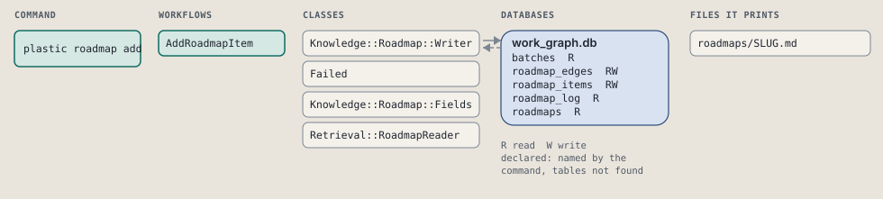
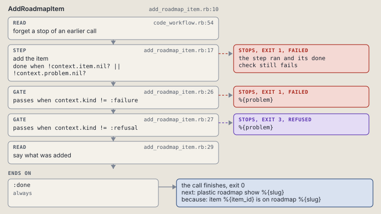

# plastic roadmap add

Add an item to a roadmap batch, with the items it needs.

```sh
plastic roadmap add SLUG N ITEM [--title TITLE] [--goal GOAL] [--done TEXT] [--needs ITEM]
```

The command is `RoadmapAdd`, in [`roadmap_add.rb:8`](../../../../scripts/lib/plastic/commands/roadmap_add.rb#L8). The words on this page, such as gate, step and outcome, are explained in [the command DSL](../../dsl/README.md).

| Argument or option | What it gives | Default |
| --- | --- | --- |
| `SLUG` | the roadmap | |
| `N` | the batch the item belongs to | |
| `ITEM` | the item's id | |
| `--title TITLE` | the item's title |  |
| `--goal GOAL` | the item's goal |  |
| `--done TEXT` | one done criterion; repeat for more | `[]` |
| `--needs ITEM` | an item this one needs; repeat for more | `[]` |

## What it touches



## How the call flows


| Workflow | Kind | Code |
| --- | --- | --- |
| [AddRoadmapItem](#addroadmapitem) | code | [`add_roadmap_item.rb:10`](../../../../scripts/lib/plastic/workflows/add_roadmap_item.rb#L10) |

### AddRoadmapItem

The code workflow `:code_add_roadmap_item`, in [`add_roadmap_item.rb:10`](../../../../scripts/lib/plastic/workflows/add_roadmap_item.rb#L10).

Adds one item to a roadmap batch, guarded against a missing batch, a predecessor not on the roadmap, and a loop over roadmap_edges.



| Step | Kind | Check | Code |
| --- | --- | --- | --- |
| forget a stop of an earlier call | read |  | [`code_workflow.rb:54`](../../../../scripts/lib/plastic/code_workflow.rb#L54) |
| add the item | step | `!context.item.nil? \|\| !context.problem.nil?` | [`add_roadmap_item.rb:17`](../../../../scripts/lib/plastic/workflows/add_roadmap_item.rb#L17) |
| %{problem} | gate, stops with exit 1 | `context.kind != :failure` | [`add_roadmap_item.rb:26`](../../../../scripts/lib/plastic/workflows/add_roadmap_item.rb#L26) |
| %{problem} | gate, stops with exit 3 | `context.kind != :refusal` | [`add_roadmap_item.rb:27`](../../../../scripts/lib/plastic/workflows/add_roadmap_item.rb#L27) |
| say what was added | read |  | [`add_roadmap_item.rb:29`](../../../../scripts/lib/plastic/workflows/add_roadmap_item.rb#L29) |

| Outcome | When | Then | Code |
| --- | --- | --- | --- |
| `:done` | always | finishes, exit 0; next: plastic roadmap show %{slug} | [`add_roadmap_item.rb:33`](../../../../scripts/lib/plastic/workflows/add_roadmap_item.rb#L33) |

It sets `problem`, `kind`, `item`.

## Outcomes

Every call can also end in [the ways any call can end](../../dsl/README.md#how-any-call-can-end).

| Ending | Exit | next: | Code |
| --- | --- | --- | --- |
| %{problem} | 1 | prints no next: line | [`add_roadmap_item.rb:26`](../../../../scripts/lib/plastic/workflows/add_roadmap_item.rb#L26) |
| %{problem} | 3 | prints no next: line | [`add_roadmap_item.rb:27`](../../../../scripts/lib/plastic/workflows/add_roadmap_item.rb#L27) |
| item %{item_id} is on roadmap %{slug} | 0 | plastic roadmap show %{slug} | [`add_roadmap_item.rb:33`](../../../../scripts/lib/plastic/workflows/add_roadmap_item.rb#L33) |
| a step raises | 1 | prints no next: line | [`code_workflow.rb:102`](../../../../scripts/lib/plastic/code_workflow.rb#L102) |
