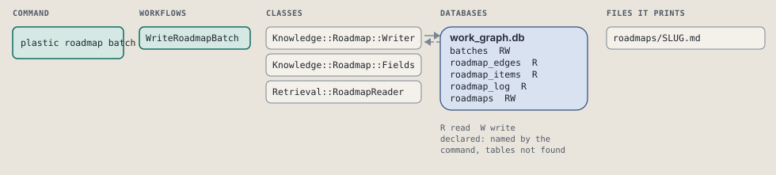
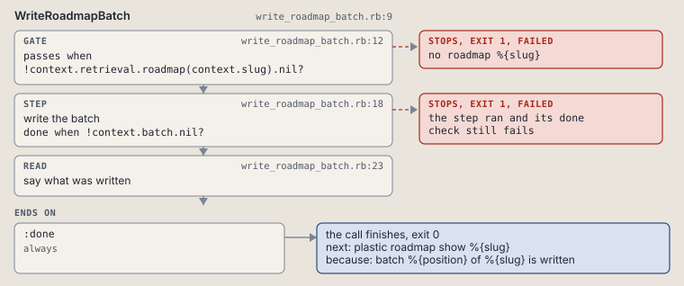

# plastic roadmap batch

Write one roadmap batch's goal and done criteria.

```sh
plastic roadmap batch SLUG N [--title TITLE] [--goal GOAL] [--done TEXT]
```

The command is `RoadmapBatch`, in [`roadmap_batch.rb:8`](../../../../scripts/lib/plastic/commands/roadmap_batch.rb#L8). The words on this page, such as gate, step and outcome, are explained in [the command DSL](../../dsl/README.md).

| Argument or option | What it gives | Default |
| --- | --- | --- |
| `SLUG` | the roadmap | |
| `N` | the batch's position, 1 and on | |
| `--title TITLE` | the batch's title |  |
| `--goal GOAL` | the batch's goal |  |
| `--done TEXT` | one done criterion; repeat for more | `[]` |

## What it touches



## How the call flows


| Workflow | Kind | Code |
| --- | --- | --- |
| [WriteRoadmapBatch](#writeroadmapbatch) | code | [`write_roadmap_batch.rb:9`](../../../../scripts/lib/plastic/workflows/write_roadmap_batch.rb#L9) |

### WriteRoadmapBatch

The code workflow `:code_write_roadmap_batch`, in [`write_roadmap_batch.rb:9`](../../../../scripts/lib/plastic/workflows/write_roadmap_batch.rb#L9).

Writes a roadmap batch's goal and done criteria on a roadmap that exists.



| Step | Kind | Check | Code |
| --- | --- | --- | --- |
| no roadmap %{slug} | gate, stops with exit 1 | `!context.retrieval.roadmap(context.slug).nil?` | [`write_roadmap_batch.rb:12`](../../../../scripts/lib/plastic/workflows/write_roadmap_batch.rb#L12) |
| write the batch | step | `!context.batch.nil?` | [`write_roadmap_batch.rb:18`](../../../../scripts/lib/plastic/workflows/write_roadmap_batch.rb#L18) |
| say what was written | read |  | [`write_roadmap_batch.rb:23`](../../../../scripts/lib/plastic/workflows/write_roadmap_batch.rb#L23) |

| Outcome | When | Then | Code |
| --- | --- | --- | --- |
| `:done` | always | finishes, exit 0; next: plastic roadmap show %{slug} | [`write_roadmap_batch.rb:27`](../../../../scripts/lib/plastic/workflows/write_roadmap_batch.rb#L27) |

It sets `batch`.

## Outcomes

Every call can also end in [the ways any call can end](../../dsl/README.md#how-any-call-can-end).

| Ending | Exit | next: | Code |
| --- | --- | --- | --- |
| no roadmap %{slug} | 1 | plastic roadmap new %{slug} | [`write_roadmap_batch.rb:12`](../../../../scripts/lib/plastic/workflows/write_roadmap_batch.rb#L12) |
| batch %{position} of %{slug} is written | 0 | plastic roadmap show %{slug} | [`write_roadmap_batch.rb:27`](../../../../scripts/lib/plastic/workflows/write_roadmap_batch.rb#L27) |
| a step raises | 1 | prints no next: line | [`code_workflow.rb:102`](../../../../scripts/lib/plastic/code_workflow.rb#L102) |
