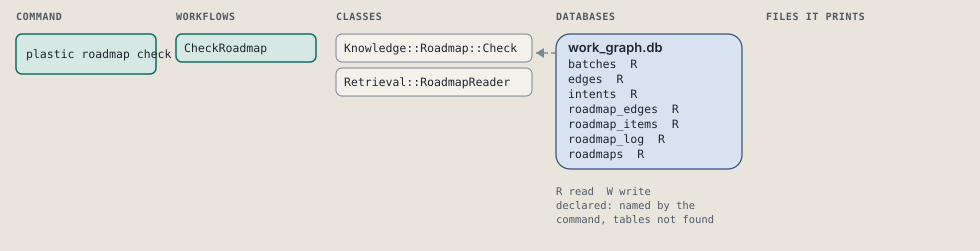
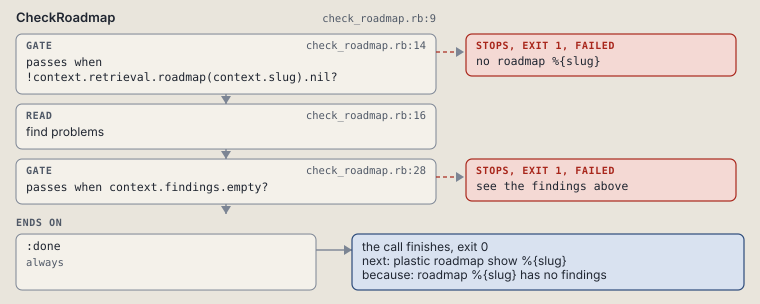

# plastic roadmap check

List a roadmap's loops, dangling edges and items with no intent.

Lists a roadmap's loops, dangling edges and items with no intent.

```sh
plastic roadmap check SLUG
```

The command is `RoadmapCheck`, in [`roadmap_check.rb:8`](../../../../scripts/lib/plastic/commands/roadmap_check.rb#L8). The words on this page, such as gate, step and outcome, are explained in [the command DSL](../../dsl/README.md).

| Argument or option | What it gives | Default |
| --- | --- | --- |
| `SLUG` | the roadmap | |

## What it touches



## How the call flows


| Workflow | Kind | Code |
| --- | --- | --- |
| [CheckRoadmap](#checkroadmap) | code | [`check_roadmap.rb:9`](../../../../scripts/lib/plastic/workflows/check_roadmap.rb#L9) |

### CheckRoadmap

The code workflow `:code_check_roadmap`, in [`check_roadmap.rb:9`](../../../../scripts/lib/plastic/workflows/check_roadmap.rb#L9).

Prints each finding, or "no findings"; a finding fails the call.



| Step | Kind | Check | Code |
| --- | --- | --- | --- |
| no roadmap %{slug} | gate, stops with exit 1 | `!context.retrieval.roadmap(context.slug).nil?` | [`check_roadmap.rb:14`](../../../../scripts/lib/plastic/workflows/check_roadmap.rb#L14) |
| find problems | read |  | [`check_roadmap.rb:16`](../../../../scripts/lib/plastic/workflows/check_roadmap.rb#L16) |
| see the findings above | gate, stops with exit 1 | `context.findings.empty?` | [`check_roadmap.rb:28`](../../../../scripts/lib/plastic/workflows/check_roadmap.rb#L28) |

| Outcome | When | Then | Code |
| --- | --- | --- | --- |
| `:done` | always | finishes, exit 0; next: plastic roadmap show %{slug} | [`check_roadmap.rb:30`](../../../../scripts/lib/plastic/workflows/check_roadmap.rb#L30) |

It sets `findings`.

## Outcomes

Every call can also end in [the ways any call can end](../../dsl/README.md#how-any-call-can-end).

| Ending | Exit | next: | Code |
| --- | --- | --- | --- |
| no roadmap %{slug} | 1 | prints no next: line | [`check_roadmap.rb:14`](../../../../scripts/lib/plastic/workflows/check_roadmap.rb#L14) |
| see the findings above | 1 | prints no next: line | [`check_roadmap.rb:28`](../../../../scripts/lib/plastic/workflows/check_roadmap.rb#L28) |
| roadmap %{slug} has no findings | 0 | plastic roadmap show %{slug} | [`check_roadmap.rb:30`](../../../../scripts/lib/plastic/workflows/check_roadmap.rb#L30) |
| a step raises | 1 | prints no next: line | [`code_workflow.rb:97`](../../../../scripts/lib/plastic/code_workflow.rb#L97) |
