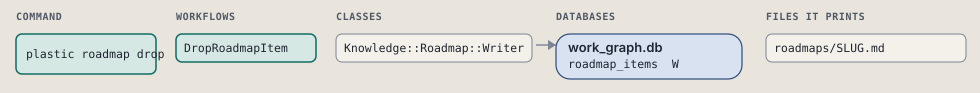
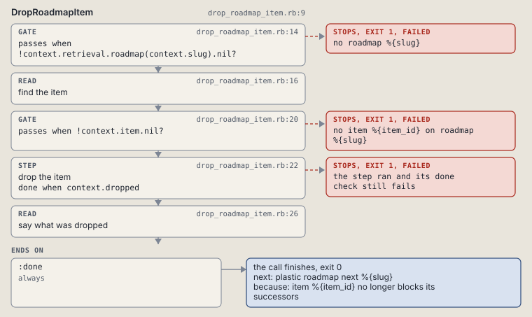

# plastic roadmap drop

Mark a roadmap item dropped; its edges stay as rows.

```sh
plastic roadmap drop SLUG ITEM [--dry-run]
```

The command is `RoadmapDrop`, in [`roadmap_drop.rb:8`](../../../../scripts/lib/plastic/commands/roadmap_drop.rb#L8). The words on this page, such as gate, step and outcome, are explained in [the command DSL](../../dsl/README.md).

| Argument or option | What it gives | Default |
| --- | --- | --- |
| `SLUG` | the roadmap | |
| `ITEM` | the item to drop | |
| `--dry-run` | preview the call in a disposable copy | `false` |

## What it touches



## How the call flows


| Workflow | Kind | Code |
| --- | --- | --- |
| [DropRoadmapItem](#droproadmapitem) | code | [`drop_roadmap_item.rb:9`](../../../../scripts/lib/plastic/workflows/drop_roadmap_item.rb#L9) |

### DropRoadmapItem

The code workflow `:code_drop_roadmap_item`, in [`drop_roadmap_item.rb:9`](../../../../scripts/lib/plastic/workflows/drop_roadmap_item.rb#L9).

Marks a roadmap item dropped. Its edges stay; items after it stop waiting for it, since a dropped predecessor counts as resolved.



| Step | Kind | Check | Code |
| --- | --- | --- | --- |
| no roadmap %{slug} | gate, stops with exit 1 | `!context.retrieval.roadmap(context.slug).nil?` | [`drop_roadmap_item.rb:14`](../../../../scripts/lib/plastic/workflows/drop_roadmap_item.rb#L14) |
| find the item | read |  | [`drop_roadmap_item.rb:16`](../../../../scripts/lib/plastic/workflows/drop_roadmap_item.rb#L16) |
| no item %{item_id} on roadmap %{slug} | gate, stops with exit 1 | `!context.item.nil?` | [`drop_roadmap_item.rb:20`](../../../../scripts/lib/plastic/workflows/drop_roadmap_item.rb#L20) |
| drop the item | step | `context.dropped` | [`drop_roadmap_item.rb:22`](../../../../scripts/lib/plastic/workflows/drop_roadmap_item.rb#L22) |
| say what was dropped | read |  | [`drop_roadmap_item.rb:26`](../../../../scripts/lib/plastic/workflows/drop_roadmap_item.rb#L26) |

| Outcome | When | Then | Code |
| --- | --- | --- | --- |
| `:done` | always | finishes, exit 0; next: plastic roadmap next %{slug} | [`drop_roadmap_item.rb:30`](../../../../scripts/lib/plastic/workflows/drop_roadmap_item.rb#L30) |

It sets `item`, `dropped`.

## Outcomes

Every call can also end in [the ways any call can end](../../dsl/README.md#how-any-call-can-end).

| Ending | Exit | next: | Code |
| --- | --- | --- | --- |
| no roadmap %{slug} | 1 | prints no next: line | [`drop_roadmap_item.rb:14`](../../../../scripts/lib/plastic/workflows/drop_roadmap_item.rb#L14) |
| no item %{item_id} on roadmap %{slug} | 1 | prints no next: line | [`drop_roadmap_item.rb:20`](../../../../scripts/lib/plastic/workflows/drop_roadmap_item.rb#L20) |
| item %{item_id} no longer blocks its successors | 0 | plastic roadmap next %{slug} | [`drop_roadmap_item.rb:30`](../../../../scripts/lib/plastic/workflows/drop_roadmap_item.rb#L30) |
| a step raises | 1 | prints no next: line | [`code_workflow.rb:97`](../../../../scripts/lib/plastic/code_workflow.rb#L97) |
