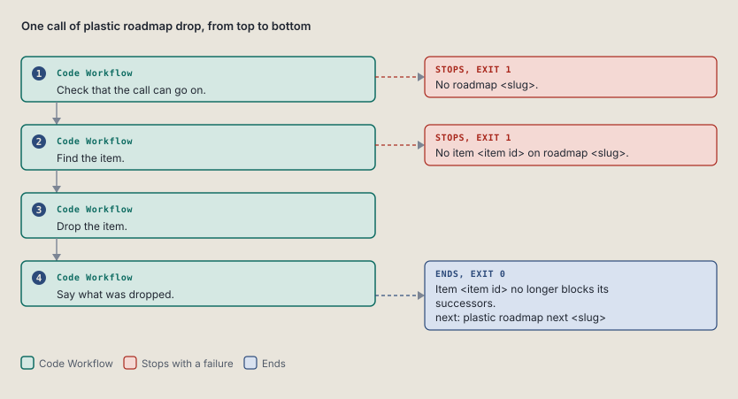

# plastic roadmap drop

Mark a roadmap item dropped; its edges stay as rows.

```sh
plastic roadmap drop SLUG ITEM [--dry-run]
```

| Argument or option | What it gives | Default |
| --- | --- | --- |
| `SLUG` | the roadmap | |
| `ITEM` | the item to drop | |
| `--dry-run` | preview the call in a disposable copy | `false` |

## The events of one call, step by step



The boxes on the left run in order. The boxes on the right are the ways the call stops or ends at that step.

## What one call changes

| What changes | Where | Reach |
| --- | --- | --- |
| The item is removed from the roadmap | the work graph database, in the store folder | goes with the store |
| The files of the roadmap are rewritten | the store folder | goes with the store |

Goes with the store: the files of the store carry the change, and `plastic sync up` rebuilds it on another machine. The database files themselves stay on this machine.

The command is `Plastic::Commands::Roadmap::Drop`, in [`drop.rb:9`](../../../../lib/plastic/commands/roadmap/drop.rb#L9).
