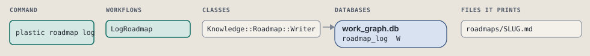
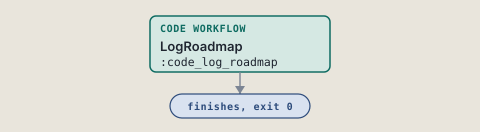
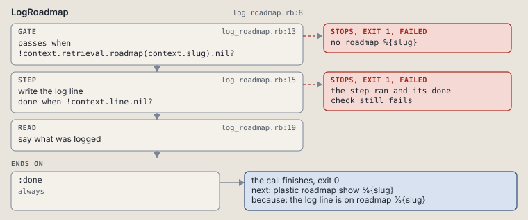

# plastic roadmap log

Append a log line to a roadmap, stamped with the session id.

```sh
plastic roadmap log SLUG TEXT...
```

The command is `RoadmapLog`, in [`roadmap_log.rb:8`](../../../../scripts/lib/plastic/commands/roadmap_log.rb#L8). The words on this page, such as gate, step and outcome, are explained in [the command DSL](../../dsl/README.md).

| Argument or option | What it gives | Default |
| --- | --- | --- |
| `SLUG` | the roadmap | |
| `TEXT` | the log line | |

## What it touches



## How the call flows



| Workflow | Kind | Code |
| --- | --- | --- |
| [LogRoadmap](#logroadmap) | code | [`log_roadmap.rb:8`](../../../../scripts/lib/plastic/workflows/log_roadmap.rb#L8) |

### LogRoadmap

The code workflow `:code_log_roadmap`, in [`log_roadmap.rb:8`](../../../../scripts/lib/plastic/workflows/log_roadmap.rb#L8).

Appends one log line to a roadmap, stamped with the session id.



| Step | Kind | Check | Code |
| --- | --- | --- | --- |
| no roadmap %{slug} | gate, stops with exit 1 | `!context.retrieval.roadmap(context.slug).nil?` | [`log_roadmap.rb:13`](../../../../scripts/lib/plastic/workflows/log_roadmap.rb#L13) |
| write the log line | step | `!context.line.nil?` | [`log_roadmap.rb:15`](../../../../scripts/lib/plastic/workflows/log_roadmap.rb#L15) |
| say what was logged | read |  | [`log_roadmap.rb:19`](../../../../scripts/lib/plastic/workflows/log_roadmap.rb#L19) |

| Outcome | When | Then | Code |
| --- | --- | --- | --- |
| `:done` | always | finishes, exit 0; next: plastic roadmap show %{slug} | [`log_roadmap.rb:23`](../../../../scripts/lib/plastic/workflows/log_roadmap.rb#L23) |

It sets `line`.

## Outcomes

Every call can also end in [the ways any call can end](../../dsl/README.md#how-any-call-can-end).

| Ending | Exit | next: | Code |
| --- | --- | --- | --- |
| no roadmap %{slug} | 1 | prints no next: line | [`log_roadmap.rb:13`](../../../../scripts/lib/plastic/workflows/log_roadmap.rb#L13) |
| the log line is on roadmap %{slug} | 0 | plastic roadmap show %{slug} | [`log_roadmap.rb:23`](../../../../scripts/lib/plastic/workflows/log_roadmap.rb#L23) |
| a step raises | 1 | prints no next: line | [`code_workflow.rb:97`](../../../../scripts/lib/plastic/code_workflow.rb#L97) |
