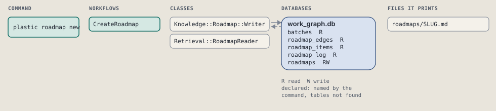
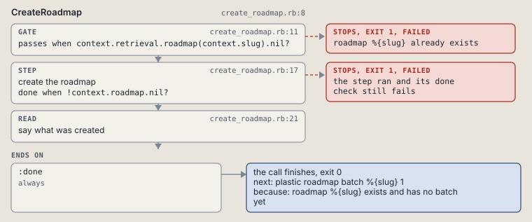

# plastic roadmap new

Create a roadmap; write its batches with roadmap batch.

Creates a roadmap; its batches come from roadmap batch.

```sh
plastic roadmap new NAME [--title TITLE] [--goal GOAL]
```

The command is `RoadmapNew`, in [`roadmap_new.rb:8`](../../../../scripts/lib/plastic/commands/roadmap_new.rb#L8). The words on this page, such as gate, step and outcome, are explained in [the command DSL](../../dsl/README.md).

| Argument or option | What it gives | Default |
| --- | --- | --- |
| `NAME` | the roadmap's name | |
| `--title TITLE` | the roadmap's title; the name when absent |  |
| `--goal GOAL` | the roadmap's goal |  |

## What it touches



## How the call flows


| Workflow | Kind | Code |
| --- | --- | --- |
| [CreateRoadmap](#createroadmap) | code | [`create_roadmap.rb:8`](../../../../scripts/lib/plastic/workflows/create_roadmap.rb#L8) |

### CreateRoadmap

The code workflow `:code_create_roadmap`, in [`create_roadmap.rb:8`](../../../../scripts/lib/plastic/workflows/create_roadmap.rb#L8).

Creates a roadmap row and offers its first batch.



| Step | Kind | Check | Code |
| --- | --- | --- | --- |
| roadmap %{slug} already exists | gate, stops with exit 1 | `context.retrieval.roadmap(context.slug).nil?` | [`create_roadmap.rb:11`](../../../../scripts/lib/plastic/workflows/create_roadmap.rb#L11) |
| create the roadmap | step | `!context.roadmap.nil?` | [`create_roadmap.rb:17`](../../../../scripts/lib/plastic/workflows/create_roadmap.rb#L17) |
| say what was created | read |  | [`create_roadmap.rb:21`](../../../../scripts/lib/plastic/workflows/create_roadmap.rb#L21) |

| Outcome | When | Then | Code |
| --- | --- | --- | --- |
| `:done` | always | finishes, exit 0; next: plastic roadmap batch %{slug} 1 | [`create_roadmap.rb:25`](../../../../scripts/lib/plastic/workflows/create_roadmap.rb#L25) |

It sets `roadmap`.

## Outcomes

Every call can also end in [the ways any call can end](../../dsl/README.md#how-any-call-can-end).

| Ending | Exit | next: | Code |
| --- | --- | --- | --- |
| roadmap %{slug} already exists | 1 | plastic roadmap show %{slug} | [`create_roadmap.rb:11`](../../../../scripts/lib/plastic/workflows/create_roadmap.rb#L11) |
| roadmap %{slug} exists and has no batch yet | 0 | plastic roadmap batch %{slug} 1 | [`create_roadmap.rb:25`](../../../../scripts/lib/plastic/workflows/create_roadmap.rb#L25) |
| a step raises | 1 | prints no next: line | [`code_workflow.rb:97`](../../../../scripts/lib/plastic/code_workflow.rb#L97) |
