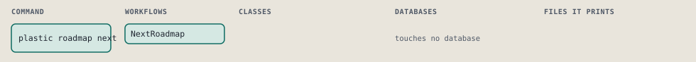
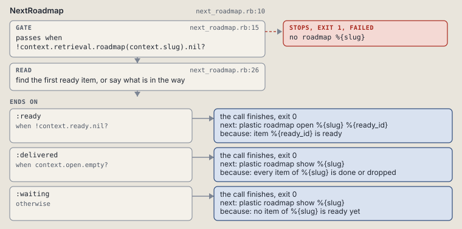

# plastic roadmap next

Print the first ready item, or what is in the way.

```sh
plastic roadmap next SLUG [--batch N]
```

The command is `RoadmapNext`, in [`roadmap_next.rb:8`](../../../../scripts/lib/plastic/commands/roadmap_next.rb#L8). The words on this page, such as gate, step and outcome, are explained in [the command DSL](../../dsl/README.md).

| Argument or option | What it gives | Default |
| --- | --- | --- |
| `SLUG` | the roadmap | |
| `--batch N` | only this batch |  |

## What it touches



## How the call flows


| Workflow | Kind | Code |
| --- | --- | --- |
| [NextRoadmap](#nextroadmap) | code | [`next_roadmap.rb:10`](../../../../scripts/lib/plastic/workflows/next_roadmap.rb#L10) |

### NextRoadmap

The code workflow `:code_next_roadmap`, in [`next_roadmap.rb:10`](../../../../scripts/lib/plastic/workflows/next_roadmap.rb#L10).

Finds the first ready item of a roadmap, ranked by batch then item position. With nothing ready, it names what is in flight and blocked.



| Step | Kind | Check | Code |
| --- | --- | --- | --- |
| no roadmap %{slug} | gate, stops with exit 1 | `!context.retrieval.roadmap(context.slug).nil?` | [`next_roadmap.rb:15`](../../../../scripts/lib/plastic/workflows/next_roadmap.rb#L15) |
| find the first ready item, or say what is in the way | read |  | [`next_roadmap.rb:26`](../../../../scripts/lib/plastic/workflows/next_roadmap.rb#L26) |

| Outcome | When | Then | Code |
| --- | --- | --- | --- |
| `:ready` | when `!context.ready.nil?` | finishes, exit 0; next: plastic roadmap open %{slug} %{ready_id} | [`next_roadmap.rb:43`](../../../../scripts/lib/plastic/workflows/next_roadmap.rb#L43) |
| `:delivered` | when `context.open.empty?` | finishes, exit 0; next: plastic roadmap show %{slug} | [`next_roadmap.rb:45`](../../../../scripts/lib/plastic/workflows/next_roadmap.rb#L45) |
| `:waiting` | otherwise | finishes, exit 0; next: plastic roadmap show %{slug} | [`next_roadmap.rb:47`](../../../../scripts/lib/plastic/workflows/next_roadmap.rb#L47) |

It sets `ready`, `ready_id`, `open`.

## Outcomes

Every call can also end in [the ways any call can end](../../dsl/README.md#how-any-call-can-end).

| Ending | Exit | next: | Code |
| --- | --- | --- | --- |
| no roadmap %{slug} | 1 | prints no next: line | [`next_roadmap.rb:15`](../../../../scripts/lib/plastic/workflows/next_roadmap.rb#L15) |
| item %{ready_id} is ready | 0 | plastic roadmap open %{slug} %{ready_id} | [`next_roadmap.rb:43`](../../../../scripts/lib/plastic/workflows/next_roadmap.rb#L43) |
| every item of %{slug} is done or dropped | 0 | plastic roadmap show %{slug} | [`next_roadmap.rb:45`](../../../../scripts/lib/plastic/workflows/next_roadmap.rb#L45) |
| no item of %{slug} is ready yet | 0 | plastic roadmap show %{slug} | [`next_roadmap.rb:47`](../../../../scripts/lib/plastic/workflows/next_roadmap.rb#L47) |
| a step raises | 1 | prints no next: line | [`code_workflow.rb:97`](../../../../scripts/lib/plastic/code_workflow.rb#L97) |
