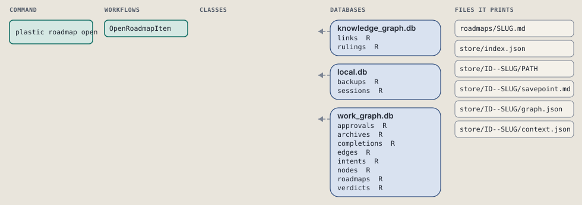
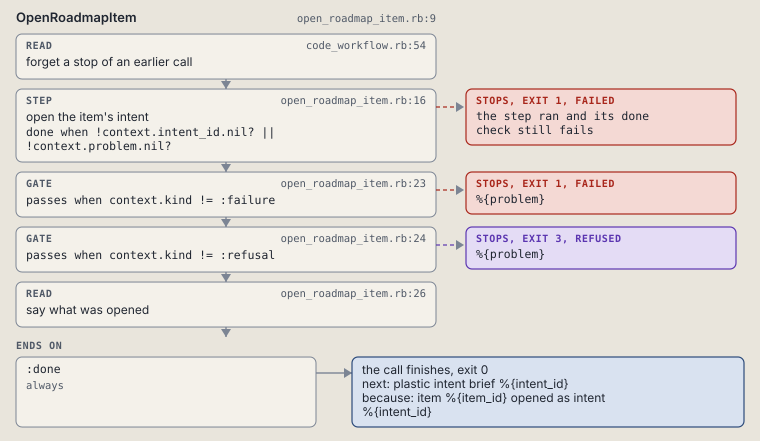

# plastic roadmap open

Open a ready item's intent, with its spec held in rows.

```sh
plastic roadmap open SLUG ITEM
```

The command is `RoadmapOpen`, in [`roadmap_open.rb:8`](../../../../scripts/lib/plastic/commands/roadmap_open.rb#L8). The words on this page, such as gate, step and outcome, are explained in [the command DSL](../../dsl/README.md).

| Argument or option | What it gives | Default |
| --- | --- | --- |
| `SLUG` | the roadmap | |
| `ITEM` | the item to open | |

## What it touches



## How the call flows


| Workflow | Kind | Code |
| --- | --- | --- |
| [OpenRoadmapItem](#openroadmapitem) | code | [`open_roadmap_item.rb:9`](../../../../scripts/lib/plastic/workflows/open_roadmap_item.rb#L9) |

### OpenRoadmapItem

The code workflow `:code_open_roadmap_item`, in [`open_roadmap_item.rb:9`](../../../../scripts/lib/plastic/workflows/open_roadmap_item.rb#L9).

Opens a ready item's intent, its spec.md holding the batch and item's goal and done criteria, then links the intent to the roadmap.



| Step | Kind | Check | Code |
| --- | --- | --- | --- |
| forget a stop of an earlier call | read |  | [`code_workflow.rb:54`](../../../../scripts/lib/plastic/code_workflow.rb#L54) |
| open the item's intent | step | `!context.intent_id.nil? \|\| !context.problem.nil?` | [`open_roadmap_item.rb:16`](../../../../scripts/lib/plastic/workflows/open_roadmap_item.rb#L16) |
| %{problem} | gate, stops with exit 1 | `context.kind != :failure` | [`open_roadmap_item.rb:23`](../../../../scripts/lib/plastic/workflows/open_roadmap_item.rb#L23) |
| %{problem} | gate, stops with exit 3 | `context.kind != :refusal` | [`open_roadmap_item.rb:24`](../../../../scripts/lib/plastic/workflows/open_roadmap_item.rb#L24) |
| say what was opened | read |  | [`open_roadmap_item.rb:26`](../../../../scripts/lib/plastic/workflows/open_roadmap_item.rb#L26) |

| Outcome | When | Then | Code |
| --- | --- | --- | --- |
| `:done` | always | finishes, exit 0; next: plastic intent brief %{intent_id} | [`open_roadmap_item.rb:30`](../../../../scripts/lib/plastic/workflows/open_roadmap_item.rb#L30) |

It sets `problem`, `kind`, `intent_id`.

## Outcomes

Every call can also end in [the ways any call can end](../../dsl/README.md#how-any-call-can-end).

| Ending | Exit | next: | Code |
| --- | --- | --- | --- |
| %{problem} | 1 | prints no next: line | [`open_roadmap_item.rb:23`](../../../../scripts/lib/plastic/workflows/open_roadmap_item.rb#L23) |
| %{problem} | 3 | prints no next: line | [`open_roadmap_item.rb:24`](../../../../scripts/lib/plastic/workflows/open_roadmap_item.rb#L24) |
| item %{item_id} opened as intent %{intent_id} | 0 | plastic intent brief %{intent_id} | [`open_roadmap_item.rb:30`](../../../../scripts/lib/plastic/workflows/open_roadmap_item.rb#L30) |
| a step raises | 1 | prints no next: line | [`code_workflow.rb:102`](../../../../scripts/lib/plastic/code_workflow.rb#L102) |
