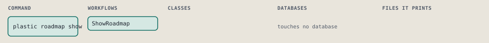
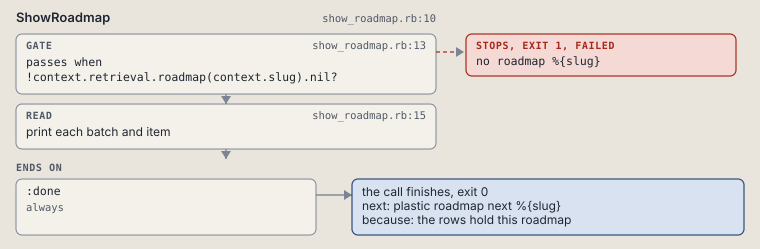

# plastic roadmap show

Print a roadmap's batches and items.

Prints a roadmap's batches and items from the rows. It reads and writes nothing.

```sh
plastic roadmap show SLUG [--batch N]
```

The command is `RoadmapShow`, in [`roadmap_show.rb:8`](../../../../scripts/lib/plastic/commands/roadmap_show.rb#L8). The words on this page, such as gate, step and outcome, are explained in [the command DSL](../../dsl/README.md).

| Argument or option | What it gives | Default |
| --- | --- | --- |
| `SLUG` | the roadmap | |
| `--batch N` | only this batch |  |

## What it touches



## How the call flows


| Workflow | Kind | Code |
| --- | --- | --- |
| [ShowRoadmap](#showroadmap) | code | [`show_roadmap.rb:10`](../../../../scripts/lib/plastic/workflows/show_roadmap.rb#L10) |

### ShowRoadmap

The code workflow `:code_show_roadmap`, in [`show_roadmap.rb:10`](../../../../scripts/lib/plastic/workflows/show_roadmap.rb#L10).

Prints each batch with its goal and done criteria, then each item with its derived state, from the rows.



| Step | Kind | Check | Code |
| --- | --- | --- | --- |
| no roadmap %{slug} | gate, stops with exit 1 | `!context.retrieval.roadmap(context.slug).nil?` | [`show_roadmap.rb:13`](../../../../scripts/lib/plastic/workflows/show_roadmap.rb#L13) |
| print each batch and item | read |  | [`show_roadmap.rb:15`](../../../../scripts/lib/plastic/workflows/show_roadmap.rb#L15) |

| Outcome | When | Then | Code |
| --- | --- | --- | --- |
| `:done` | always | finishes, exit 0; next: plastic roadmap next %{slug} | [`show_roadmap.rb:19`](../../../../scripts/lib/plastic/workflows/show_roadmap.rb#L19) |

## Outcomes

Every call can also end in [the ways any call can end](../../dsl/README.md#how-any-call-can-end).

| Ending | Exit | next: | Code |
| --- | --- | --- | --- |
| no roadmap %{slug} | 1 | prints no next: line | [`show_roadmap.rb:13`](../../../../scripts/lib/plastic/workflows/show_roadmap.rb#L13) |
| the rows hold this roadmap | 0 | plastic roadmap next %{slug} | [`show_roadmap.rb:19`](../../../../scripts/lib/plastic/workflows/show_roadmap.rb#L19) |
| a step raises | 1 | prints no next: line | [`code_workflow.rb:97`](../../../../scripts/lib/plastic/code_workflow.rb#L97) |
