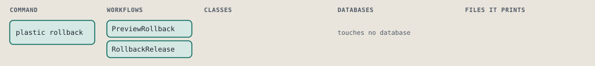
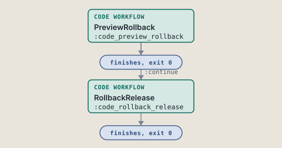
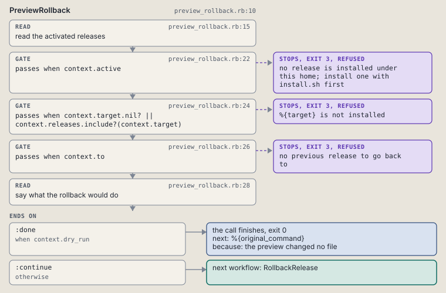
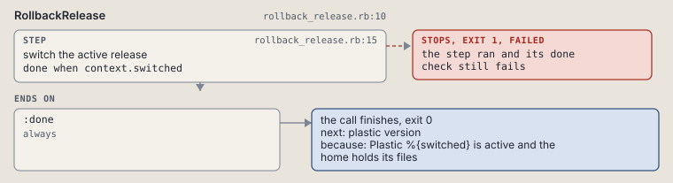

# plastic rollback

Switch the active release back to the previous one or to a named installed one.

```sh
plastic rollback [--version VERSION] [--dry-run]
```

The command is `Rollback`, in [`rollback.rb:9`](../../../../scripts/lib/plastic/commands/rollback.rb#L9). The words on this page, such as gate, step and outcome, are explained in [the command DSL](../../dsl/README.md).

| Argument or option | What it gives | Default |
| --- | --- | --- |
| `--version VERSION` | an installed release to switch to |  |
| `--dry-run` | name the switch and change nothing | `false` |

## What it touches



## How the call flows



| Workflow | Kind | Code |
| --- | --- | --- |
| [PreviewRollback](#previewrollback) | code | [`preview_rollback.rb:10`](../../../../scripts/lib/plastic/workflows/preview_rollback.rb#L10) |
| [RollbackRelease](#rollbackrelease) | code | [`rollback_release.rb:10`](../../../../scripts/lib/plastic/workflows/rollback_release.rb#L10) |

### PreviewRollback

The code workflow `:code_preview_rollback`, in [`preview_rollback.rb:10`](../../../../scripts/lib/plastic/workflows/preview_rollback.rb#L10).

Reads the activated releases and picks the one to switch to: the named version, or the previous release. A dry run names the switch.



| Step | Kind | Check | Code |
| --- | --- | --- | --- |
| read the activated releases | read |  | [`preview_rollback.rb:15`](../../../../scripts/lib/plastic/workflows/preview_rollback.rb#L15) |
| no release is installed under this home; install one with install.sh first | gate, stops with exit 3 | `context.active` | [`preview_rollback.rb:22`](../../../../scripts/lib/plastic/workflows/preview_rollback.rb#L22) |
| %{target} is not installed | gate, stops with exit 3 | `context.target.nil? \|\| context.releases.include?(context.target)` | [`preview_rollback.rb:24`](../../../../scripts/lib/plastic/workflows/preview_rollback.rb#L24) |
| no previous release to go back to | gate, stops with exit 3 | `context.to` | [`preview_rollback.rb:26`](../../../../scripts/lib/plastic/workflows/preview_rollback.rb#L26) |
| say what the rollback would do | read |  | [`preview_rollback.rb:28`](../../../../scripts/lib/plastic/workflows/preview_rollback.rb#L28) |

| Outcome | When | Then | Code |
| --- | --- | --- | --- |
| `:done` | when `context.dry_run` | finishes, exit 0; next: %{original_command} | [`preview_rollback.rb:36`](../../../../scripts/lib/plastic/workflows/preview_rollback.rb#L36) |
| `:continue` | otherwise | runs [RollbackRelease](#rollbackrelease) | [`preview_rollback.rb:37`](../../../../scripts/lib/plastic/workflows/preview_rollback.rb#L37) |

It sets `active`, `to`, `releases`.

### RollbackRelease

The code workflow `:code_rollback_release`, in [`rollback_release.rb:10`](../../../../scripts/lib/plastic/workflows/rollback_release.rb#L10).

Switches the active pointer to the named release or the previous one, and syncs that release's files into the home in the same activation.



| Step | Kind | Check | Code |
| --- | --- | --- | --- |
| switch the active release | step | `context.switched` | [`rollback_release.rb:15`](../../../../scripts/lib/plastic/workflows/rollback_release.rb#L15) |

| Outcome | When | Then | Code |
| --- | --- | --- | --- |
| `:done` | always | finishes, exit 0; next: plastic version | [`rollback_release.rb:20`](../../../../scripts/lib/plastic/workflows/rollback_release.rb#L20) |

It sets `switched`.

## Outcomes

Every call can also end in [the ways any call can end](../../dsl/README.md#how-any-call-can-end).

| Ending | Exit | next: | Code |
| --- | --- | --- | --- |
| no release is installed under this home; install one with install.sh first | 3 | prints no next: line | [`preview_rollback.rb:22`](../../../../scripts/lib/plastic/workflows/preview_rollback.rb#L22) |
| %{target} is not installed | 3 | prints no next: line | [`preview_rollback.rb:24`](../../../../scripts/lib/plastic/workflows/preview_rollback.rb#L24) |
| no previous release to go back to | 3 | prints no next: line | [`preview_rollback.rb:26`](../../../../scripts/lib/plastic/workflows/preview_rollback.rb#L26) |
| the preview changed no file | 0 | %{original_command} | [`preview_rollback.rb:36`](../../../../scripts/lib/plastic/workflows/preview_rollback.rb#L36) |
| Plastic %{switched} is active and the home holds its files | 0 | plastic version | [`rollback_release.rb:20`](../../../../scripts/lib/plastic/workflows/rollback_release.rb#L20) |
| a step raises | 1 | prints no next: line | [`code_workflow.rb:97`](../../../../scripts/lib/plastic/code_workflow.rb#L97) |
