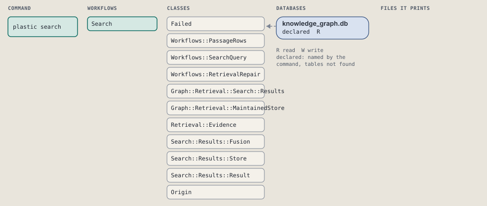
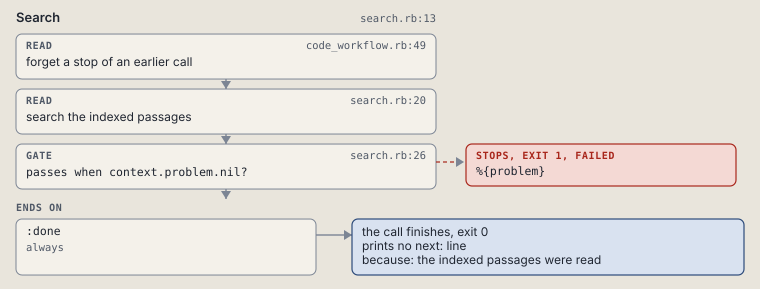

# plastic search

Search literal indexed passages across selected stores.

Searches literal indexed passages in the selected local stores.

```sh
plastic search TERMS... [--source-project SLUG] [--limit N]
```

The command is `Search`, in [`search.rb:8`](../../../../scripts/lib/plastic/commands/search.rb#L8). The words on this page, such as gate, step and outcome, are explained in [the command DSL](../../dsl/README.md).

| Argument or option | What it gives | Default |
| --- | --- | --- |
| `TERMS` | literal search terms | |
| `--source-project SLUG` | a source store | `[]` |
| `--limit N` | maximum passages | `20` |

## What it touches



## How the call flows


| Workflow | Kind | Code |
| --- | --- | --- |
| [Search](#search) | code | [`search.rb:12`](../../../../scripts/lib/plastic/workflows/search.rb#L12) |

### Search

The code workflow `:code_search`, in [`search.rb:12`](../../../../scripts/lib/plastic/workflows/search.rb#L12).

Searches literal indexed passages in the selected local stores and reports them as one fused list.



| Step | Kind | Check | Code |
| --- | --- | --- | --- |
| forget a stop of an earlier call | read |  | [`code_workflow.rb:54`](../../../../scripts/lib/plastic/code_workflow.rb#L54) |
| search the indexed passages | read |  | [`search.rb:19`](../../../../scripts/lib/plastic/workflows/search.rb#L19) |
| %{problem} | gate, stops with exit 1 | `context.problem.nil?` | [`search.rb:25`](../../../../scripts/lib/plastic/workflows/search.rb#L25) |

| Outcome | When | Then | Code |
| --- | --- | --- | --- |
| `:done` | always | finishes, exit 0; prints no next: line | [`search.rb:27`](../../../../scripts/lib/plastic/workflows/search.rb#L27) |

It sets `problem`.

## Outcomes

Every call can also end in [the ways any call can end](../../dsl/README.md#how-any-call-can-end).

| Ending | Exit | next: | Code |
| --- | --- | --- | --- |
| %{problem} | 1 | prints no next: line | [`search.rb:25`](../../../../scripts/lib/plastic/workflows/search.rb#L25) |
| the indexed passages were read | 0 | prints no next: line | [`search.rb:27`](../../../../scripts/lib/plastic/workflows/search.rb#L27) |
| a step raises | 1 | prints no next: line | [`code_workflow.rb:102`](../../../../scripts/lib/plastic/code_workflow.rb#L102) |
