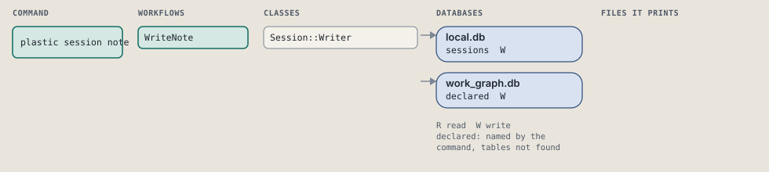
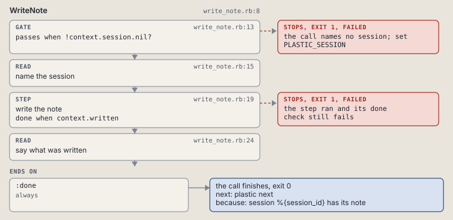

# plastic session note

Write the one prose line of this session.

Writes the one prose line of a session: what the routine runs cannot say.

```sh
plastic session note TEXT...
```

The command is `SessionNote`, in [`session_note.rb:8`](../../../../scripts/lib/plastic/commands/session_note.rb#L8). The words on this page, such as gate, step and outcome, are explained in [the command DSL](../../dsl/README.md).

| Argument or option | What it gives | Default |
| --- | --- | --- |
| `TEXT` | the note, in words | |

## What it touches



## How the call flows


| Workflow | Kind | Code |
| --- | --- | --- |
| [WriteNote](#writenote) | code | [`write_note.rb:8`](../../../../scripts/lib/plastic/workflows/write_note.rb#L8) |

### WriteNote

The code workflow `:code_write_note`, in [`write_note.rb:8`](../../../../scripts/lib/plastic/workflows/write_note.rb#L8).

Writes the one prose line of a session.



| Step | Kind | Check | Code |
| --- | --- | --- | --- |
| the call names no session; set PLASTIC_SESSION | gate, stops with exit 1 | `!context.session.nil?` | [`write_note.rb:13`](../../../../scripts/lib/plastic/workflows/write_note.rb#L13) |
| name the session | read |  | [`write_note.rb:15`](../../../../scripts/lib/plastic/workflows/write_note.rb#L15) |
| write the note | step | `context.written` | [`write_note.rb:19`](../../../../scripts/lib/plastic/workflows/write_note.rb#L19) |
| say what was written | read |  | [`write_note.rb:24`](../../../../scripts/lib/plastic/workflows/write_note.rb#L24) |

| Outcome | When | Then | Code |
| --- | --- | --- | --- |
| `:done` | always | finishes, exit 0; next: plastic next | [`write_note.rb:28`](../../../../scripts/lib/plastic/workflows/write_note.rb#L28) |

It sets `session_id`, `written`.

## Outcomes

Every call can also end in [the ways any call can end](../../dsl/README.md#how-any-call-can-end).

| Ending | Exit | next: | Code |
| --- | --- | --- | --- |
| the call names no session; set PLASTIC_SESSION | 1 | prints no next: line | [`write_note.rb:13`](../../../../scripts/lib/plastic/workflows/write_note.rb#L13) |
| session %{session_id} has its note | 0 | plastic next | [`write_note.rb:28`](../../../../scripts/lib/plastic/workflows/write_note.rb#L28) |
| a step raises | 1 | prints no next: line | [`code_workflow.rb:97`](../../../../scripts/lib/plastic/code_workflow.rb#L97) |
