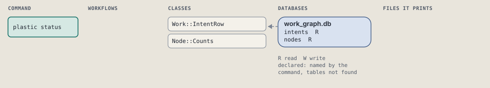
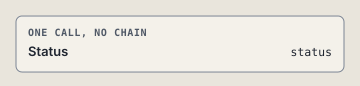

# plastic status

List every store's open and active intents, with node counts by state.

Every store under the Plastic home, its open and active intents, and their node counts by state.

```sh
plastic status
```

The command is `Status`, in [`status.rb:12`](../../../../scripts/lib/plastic/commands/status.rb#L12). The words on this page, such as gate, step and outcome, are explained in [the command DSL](../../dsl/README.md).

## What it touches



## Before the chain

The command's own `call`, at [`status.rb:15`](../../../../scripts/lib/plastic/commands/status.rb#L15), runs first:

```ruby
def call
  projects = scope.projects
  shown = slugs.map { |slug| store_rows(slug, projects) }
  output.rows(shown.flat_map(&:first))
  offer_next(shown.filter_map(&:last).first)
end
```

## How the call flows



## Outcomes

Every call can also end in [the ways any call can end](../../dsl/README.md#how-any-call-can-end).

| Ending | Exit | next: | Code |
| --- | --- | --- | --- |
| return output.next_step("plastic next", because: "pick the one to work on") unless create_store | 0 | plastic next | [`status.rb:27`](../../../../scripts/lib/plastic/commands/status.rb#L27) |
| output.next_step(create_store, because: "the project has no store") | 0 | decided at run time | [`status.rb:29`](../../../../scripts/lib/plastic/commands/status.rb#L29) |
