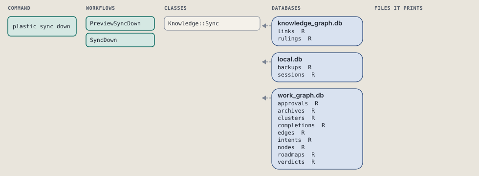
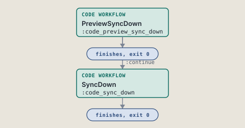
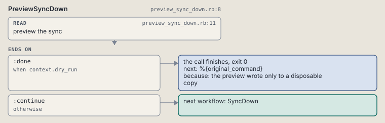
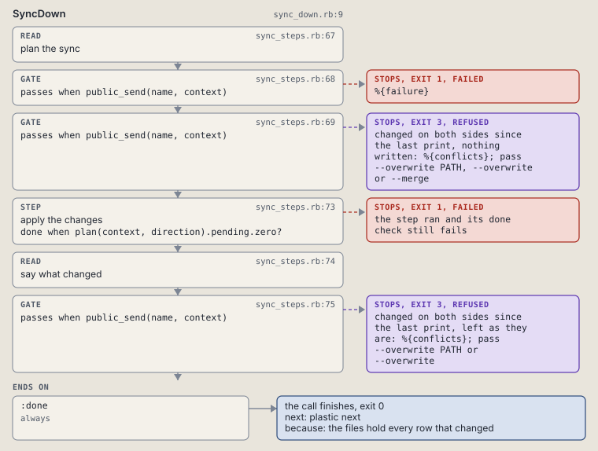

# plastic sync down

Write the rows that changed into files.

Writes the rows that changed into files. A record changed on both sides stops the call, exit 3, and every conflict is listed.

```sh
plastic sync down [--overwrite [PATH]] [--merge] [--dry-run]
```

The command is `SyncDown`, in [`sync_down.rb:11`](../../../../scripts/lib/plastic/commands/sync_down.rb#L11). The words on this page, such as gate, step and outcome, are explained in [the command DSL](../../dsl/README.md).

| Argument or option | What it gives | Default |
| --- | --- | --- |
| `--overwrite [PATH]` | settle conflicts on this side: one record by its path, or every record with no path | `false` |
| `--merge` | apply the one-sided changes, then list the conflicts | `false` |
| `--dry-run` | preview the complete sync in a disposable copy | `false` |

## What it touches



## How the call flows



| Workflow | Kind | Code |
| --- | --- | --- |
| [PreviewSyncDown](#previewsyncdown) | code | [`preview_sync_down.rb:8`](../../../../scripts/lib/plastic/workflows/preview_sync_down.rb#L8) |
| [SyncDown](#syncdown) | code | [`sync_down.rb:9`](../../../../scripts/lib/plastic/workflows/sync_down.rb#L9) |

### PreviewSyncDown

The code workflow `:code_preview_sync_down`, in [`preview_sync_down.rb:8`](../../../../scripts/lib/plastic/workflows/preview_sync_down.rb#L8).

Previews sync down in a copy before the normal write workflow.



| Step | Kind | Check | Code |
| --- | --- | --- | --- |
| preview the sync | read |  | [`preview_sync_down.rb:11`](../../../../scripts/lib/plastic/workflows/preview_sync_down.rb#L11) |

| Outcome | When | Then | Code |
| --- | --- | --- | --- |
| `:done` | when `context.dry_run` | finishes, exit 0; next: %{original_command} | [`preview_sync_down.rb:19`](../../../../scripts/lib/plastic/workflows/preview_sync_down.rb#L19) |
| `:continue` | otherwise | runs [SyncDown](#syncdown) | [`preview_sync_down.rb:21`](../../../../scripts/lib/plastic/workflows/preview_sync_down.rb#L21) |

### SyncDown

The code workflow `:code_sync_down`, in [`sync_down.rb:9`](../../../../scripts/lib/plastic/workflows/sync_down.rb#L9).

Sync down: plans, applies, and refuses on the conflicts left.



| Step | Kind | Check | Code |
| --- | --- | --- | --- |
| plan the sync | read |  | [`sync_steps.rb:67`](../../../../scripts/lib/plastic/workflows/sync_steps.rb#L67) |
| %{failure} | gate, stops with exit 1 | `public_send(name, context)` | [`sync_steps.rb:68`](../../../../scripts/lib/plastic/workflows/sync_steps.rb#L68) |
| changed on both sides since the last print, nothing written: %{conflicts}; pass --overwrite PATH, --overwrite or --merge | gate, stops with exit 3 | `public_send(name, context)` | [`sync_steps.rb:69`](../../../../scripts/lib/plastic/workflows/sync_steps.rb#L69) |
| apply the changes | step | `plan(context, direction).pending.zero?` | [`sync_steps.rb:73`](../../../../scripts/lib/plastic/workflows/sync_steps.rb#L73) |
| say what changed | read |  | [`sync_steps.rb:74`](../../../../scripts/lib/plastic/workflows/sync_steps.rb#L74) |
| changed on both sides since the last print, left as they are: %{conflicts}; pass --overwrite PATH or --overwrite | gate, stops with exit 3 | `public_send(name, context)` | [`sync_steps.rb:75`](../../../../scripts/lib/plastic/workflows/sync_steps.rb#L75) |

| Outcome | When | Then | Code |
| --- | --- | --- | --- |
| `:done` | always | finishes, exit 0; next: plastic next | [`sync_steps.rb:63`](../../../../scripts/lib/plastic/workflows/sync_steps.rb#L63) |

It sets `failure`, `conflicts`, `merging`, `unreadable`, `lines`.

## Outcomes

Every call can also end in [the ways any call can end](../../dsl/README.md#how-any-call-can-end).

| Ending | Exit | next: | Code |
| --- | --- | --- | --- |
| the preview wrote only to a disposable copy | 0 | %{original_command} | [`preview_sync_down.rb:19`](../../../../scripts/lib/plastic/workflows/preview_sync_down.rb#L19) |
| %{failure} | 1 | prints no next: line | [`sync_steps.rb:68`](../../../../scripts/lib/plastic/workflows/sync_steps.rb#L68) |
| changed on both sides since the last print, nothing written: %{conflicts}; pass --overwrite PATH, --overwrite or --merge | 3 | prints no next: line | [`sync_steps.rb:69`](../../../../scripts/lib/plastic/workflows/sync_steps.rb#L69) |
| changed on both sides since the last print, left as they are: %{conflicts}; pass --overwrite PATH or --overwrite | 3 | prints no next: line | [`sync_steps.rb:75`](../../../../scripts/lib/plastic/workflows/sync_steps.rb#L75) |
| the files hold every row that changed | 0 | plastic next | [`sync_steps.rb:63`](../../../../scripts/lib/plastic/workflows/sync_steps.rb#L63) |
| a step raises | 1 | prints no next: line | [`code_workflow.rb:102`](../../../../scripts/lib/plastic/code_workflow.rb#L102) |
