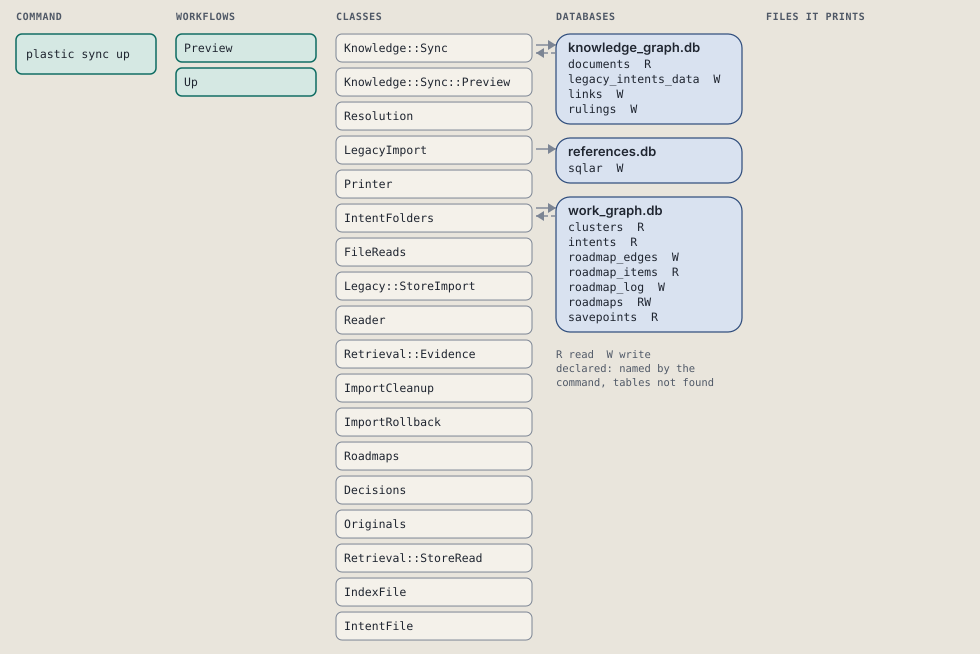
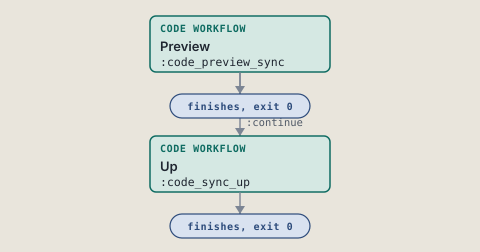
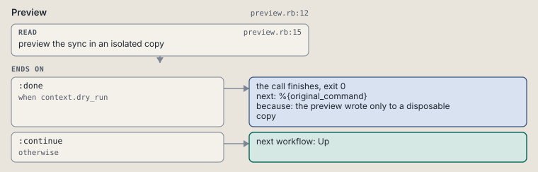
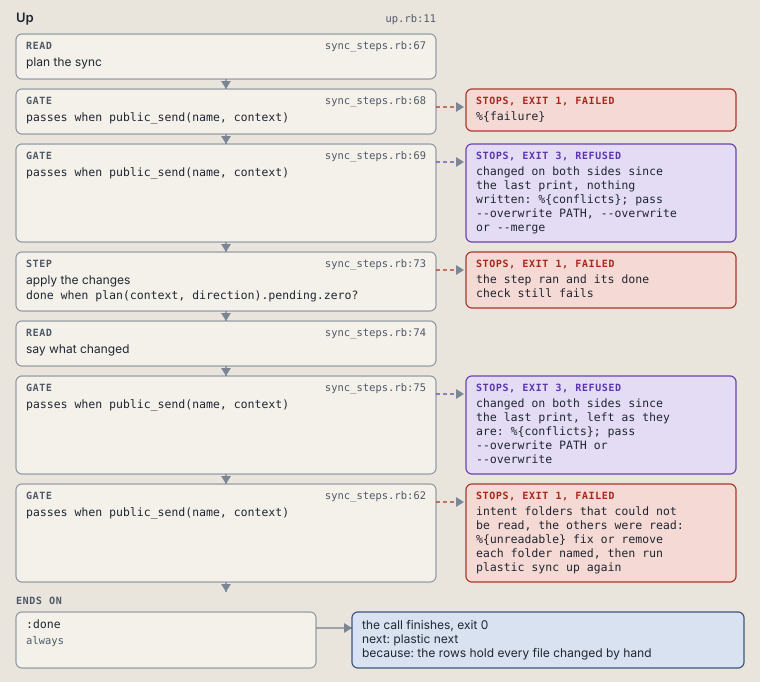
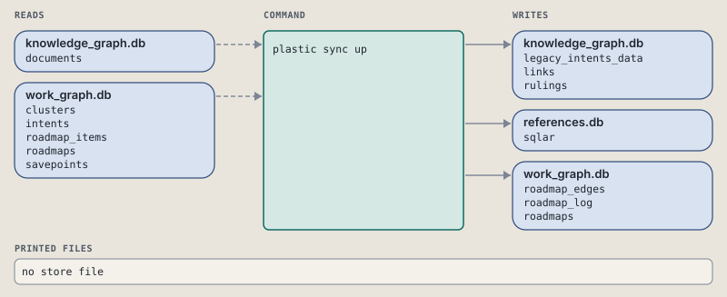

# plastic sync up

Read the files changed by hand into rows.

Reads the files people changed into rows. A record changed on both sides stops the call, exit 3, and every conflict is listed.

```sh
plastic sync up [--overwrite [PATH]] [--merge] [--dry-run]
```

The command is `Sync::Up`, in [`up.rb:12`](../../../../lib/plastic/commands/sync/up.rb#L12). The words on this page, such as gate, step and outcome, are explained in [the command DSL](../../dsl/README.md).

| Argument or option | What it gives | Default |
| --- | --- | --- |
| `--overwrite [PATH]` | settle conflicts on this side: one record by its path, or every record with no path | `false` |
| `--merge` | apply the one-sided changes, then list the conflicts | `false` |
| `--dry-run` | preview the complete sync in a disposable copy | `false` |

## Components



The figure shows the command, the workflows it runs, the classes behind them, and the databases and files they reach.

## The events of one call



| Workflow | Kind | Code |
| --- | --- | --- |
| [Code::Sync::Up::Preview](#codesyncuppreview) | code | [`preview.rb:12`](../../../../lib/plastic/workflows/code/sync/up/preview.rb#L12) |
| [Code::Sync::Up](#codesyncup) | code | [`up.rb:11`](../../../../lib/plastic/workflows/code/sync/up.rb#L11) |

### Code::Sync::Up::Preview

The code workflow `:code_preview_sync`, in [`preview.rb:12`](../../../../lib/plastic/workflows/code/sync/up/preview.rb#L12).

Previews the same sync in a copy before the normal write workflow.



Its rows run in this order:

1. Read: preview the sync in an isolated copy. [`preview.rb:15`](../../../../lib/plastic/workflows/code/sync/up/preview.rb#L15)
2. Outcome `:done`, when `context.dry_run`: finishes with exit 0; next: ORIGINAL_COMMAND. [`preview.rb:22`](../../../../lib/plastic/workflows/code/sync/up/preview.rb#L22)
3. Outcome `:continue`, otherwise: starts the workflow [Code::Sync::Up](#codesyncup). [`preview.rb:24`](../../../../lib/plastic/workflows/code/sync/up/preview.rb#L24)

### Code::Sync::Up

The code workflow `:code_sync_up`, in [`up.rb:11`](../../../../lib/plastic/workflows/code/sync/up.rb#L11).

Sync up: plans, applies, and refuses on the conflicts left.



Its rows run in this order:

1. Read: plan the sync. [`sync_steps.rb:67`](../../../../lib/plastic/workflows/sync_steps.rb#L67)
2. Gate: passes when `public_send(name, context)`; otherwise the call stops with exit 1 and prints FAILURE. [`sync_steps.rb:68`](../../../../lib/plastic/workflows/sync_steps.rb#L68)
3. Gate: passes when `public_send(name, context)`; otherwise the call stops with exit 3 and prints changed on both sides since the last print, nothing written: CONFLICTS; pass --overwrite PATH, --overwrite or --merge. [`sync_steps.rb:69`](../../../../lib/plastic/workflows/sync_steps.rb#L69)
4. Step: apply the changes. Done when `plan(context, direction).pending.zero?`, so a second call skips it. [`sync_steps.rb:73`](../../../../lib/plastic/workflows/sync_steps.rb#L73)
5. Read: say what changed. [`sync_steps.rb:74`](../../../../lib/plastic/workflows/sync_steps.rb#L74)
6. Gate: passes when `public_send(name, context)`; otherwise the call stops with exit 3 and prints changed on both sides since the last print, left as they are: CONFLICTS; pass --overwrite PATH or --overwrite. [`sync_steps.rb:75`](../../../../lib/plastic/workflows/sync_steps.rb#L75)
7. Gate: passes when `public_send(name, context)`; otherwise the call stops with exit 1 and prints intent folders that could not be read, the others were read: UNREADABLE fix or remove each folder named, then run plastic sync up again. [`sync_steps.rb:62`](../../../../lib/plastic/workflows/sync_steps.rb#L62)
8. Outcome `:done`, always: finishes with exit 0; next: plastic next. [`sync_steps.rb:63`](../../../../lib/plastic/workflows/sync_steps.rb#L63)

It sets `failure`, `conflicts`, `merging`, `unreadable`, `lines`.

In the words of workflow engines, the rows are these four parts:

- **Trigger**: the call starts the workflow `Code::Sync::Up::Preview`; each later workflow starts from an outcome of the one before it.
- **Activities**: 3 reads and 1 step.
- **Transitions**: 4 gates stop the call when their checks fail; a step runs only while its done check fails; Preview goes to Up on `:continue`.
- **Outcomes**: `:done` of Preview, `:done` of Up end the call.

## What one call reads, writes and prints



| Place | Database or file | Tables | Reads or writes | Code |
| --- | --- | --- | --- | --- |
| the store folder | knowledge_graph.db | `documents`, `legacy_intents_data`, `links`, `rulings` | reads and writes | [`sync_options.rb:12`](../../../../lib/plastic/cli/sync_options.rb#L12) |
| the store folder | references.db | `sqlar` | writes | [`sync_options.rb:12`](../../../../lib/plastic/cli/sync_options.rb#L12) |
| the store folder | work_graph.db | `clusters`, `intents`, `roadmap_edges`, `roadmap_items`, `roadmap_log`, `roadmaps`, `savepoints` | reads and writes | [`sync_options.rb:12`](../../../../lib/plastic/cli/sync_options.rb#L12) |

A second call runs the same rows again. A step runs again only when its done check fails.

| Step | Done when | The second call | Code |
| --- | --- | --- | --- |
| apply the changes | `plan(context, direction).pending.zero?` | skips it | [`sync_steps.rb:73`](../../../../lib/plastic/workflows/sync_steps.rb#L73) |

## How a call ends

Every call can also end in [the ways any call can end](../../dsl/README.md#how-any-call-can-end).

| Ending | Exit | next: | Code |
| --- | --- | --- | --- |
| the preview wrote only to a disposable copy | 0 | ORIGINAL_COMMAND | [`preview.rb:22`](../../../../lib/plastic/workflows/code/sync/up/preview.rb#L22) |
| FAILURE | 1 | prints no next: line | [`sync_steps.rb:68`](../../../../lib/plastic/workflows/sync_steps.rb#L68) |
| changed on both sides since the last print, nothing written: CONFLICTS; pass --overwrite PATH, --overwrite or --merge | 3 | prints no next: line | [`sync_steps.rb:69`](../../../../lib/plastic/workflows/sync_steps.rb#L69) |
| changed on both sides since the last print, left as they are: CONFLICTS; pass --overwrite PATH or --overwrite | 3 | prints no next: line | [`sync_steps.rb:75`](../../../../lib/plastic/workflows/sync_steps.rb#L75) |
| intent folders that could not be read, the others were read: UNREADABLE fix or remove each folder named, then run plastic sync up again | 1 | prints no next: line | [`sync_steps.rb:62`](../../../../lib/plastic/workflows/sync_steps.rb#L62) |
| the rows hold every file changed by hand | 0 | plastic next | [`sync_steps.rb:63`](../../../../lib/plastic/workflows/sync_steps.rb#L63) |
| a step raises | 1 | prints no next: line | [`code_workflow.rb:102`](../../../../lib/plastic/code_workflow.rb#L102) |

## What the page leaves out

Every call shares a few things that this page does not repeat; [the command DSL](../../dsl/README.md#what-every-call-shares) names them.

- A call that writes saves a routine run row in local.db. A stop by a gate or a step saves the run, and the next call resumes from it. A dry run saves no row.
