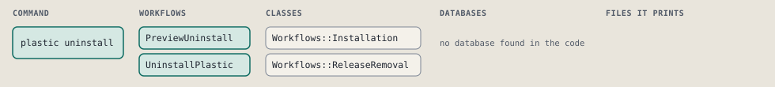
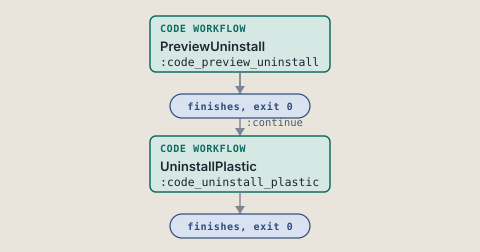
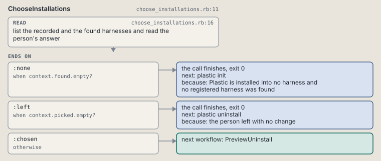
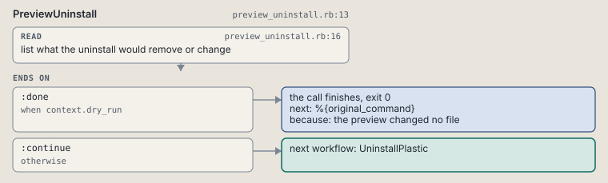
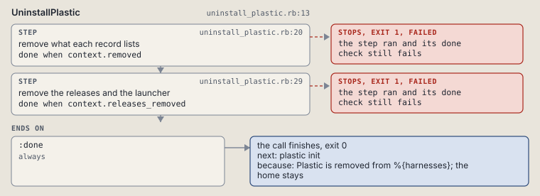

# plastic uninstall

Remove Plastic from agents and keep the home.

Shows the harnesses Plastic is installed into or found in, with every recorded one picked, and removes what the record of each picked one lists. The home and its stores stay. See docs/help/choice-screen.md.

```sh
plastic uninstall [ANSWER] [--dry-run]
```

The command is `Uninstall`, in [`uninstall.rb:12`](../../../../scripts/lib/plastic/commands/uninstall.rb#L12). The words on this page, such as gate, step and outcome, are explained in [the command DSL](../../dsl/README.md).

| Argument or option | What it gives | Default |
| --- | --- | --- |
| `ANSWER` | the person's answer to the numbered list | |
| `--dry-run` | list what would change and change nothing | `false` |

## What it touches



## Before the chain

The command's own `call`, at [`harness_pick.rb:12`](../../../../scripts/lib/plastic/commands/harness_pick.rb#L12), runs first:

```ruby
def call
  answer = parsed[:answer] ||= answered_on_screen
  super if answer
end
```

## How the call flows



| Workflow | Kind | Code |
| --- | --- | --- |
| [ChooseInstallations](#chooseinstallations) | code | [`choose_installations.rb:11`](../../../../scripts/lib/plastic/workflows/choose_installations.rb#L11) |
| [PreviewUninstall](#previewuninstall) | code | [`preview_uninstall.rb:13`](../../../../scripts/lib/plastic/workflows/preview_uninstall.rb#L13) |
| [UninstallPlastic](#uninstallplastic) | code | [`uninstall_plastic.rb:13`](../../../../scripts/lib/plastic/workflows/uninstall_plastic.rb#L13) |

### ChooseInstallations

The code workflow `:code_choose_installations`, in [`choose_installations.rb:11`](../../../../scripts/lib/plastic/workflows/choose_installations.rb#L11).

Reads the person's answer against the harnesses Plastic is installed into or found in.



| Step | Kind | Check | Code |
| --- | --- | --- | --- |
| list the recorded and the found harnesses and read the person's answer | read |  | [`choose_installations.rb:16`](../../../../scripts/lib/plastic/workflows/choose_installations.rb#L16) |

| Outcome | When | Then | Code |
| --- | --- | --- | --- |
| `:none` | when `context.found.empty?` | finishes, exit 0; next: plastic init | [`choose_installations.rb:25`](../../../../scripts/lib/plastic/workflows/choose_installations.rb#L25) |
| `:left` | when `context.picked.empty?` | finishes, exit 0; next: plastic uninstall | [`choose_installations.rb:27`](../../../../scripts/lib/plastic/workflows/choose_installations.rb#L27) |
| `:chosen` | otherwise | runs [PreviewUninstall](#previewuninstall) | [`choose_installations.rb:29`](../../../../scripts/lib/plastic/workflows/choose_installations.rb#L29) |

It sets `found`, `picked`, `harnesses`.

### PreviewUninstall

The code workflow `:code_preview_uninstall`, in [`preview_uninstall.rb:13`](../../../../scripts/lib/plastic/workflows/preview_uninstall.rb#L13).

On a dry run, lists what the record of each picked harness names, the releases and the launcher among them when no harness stays installed, and the home it keeps.



| Step | Kind | Check | Code |
| --- | --- | --- | --- |
| list what the uninstall would remove or change | read |  | [`preview_uninstall.rb:16`](../../../../scripts/lib/plastic/workflows/preview_uninstall.rb#L16) |

| Outcome | When | Then | Code |
| --- | --- | --- | --- |
| `:done` | when `context.dry_run` | finishes, exit 0; next: %{original_command} | [`preview_uninstall.rb:26`](../../../../scripts/lib/plastic/workflows/preview_uninstall.rb#L26) |
| `:continue` | otherwise | runs [UninstallPlastic](#uninstallplastic) | [`preview_uninstall.rb:28`](../../../../scripts/lib/plastic/workflows/preview_uninstall.rb#L28) |

### UninstallPlastic

The code workflow `:code_uninstall_plastic`, in [`uninstall_plastic.rb:13`](../../../../scripts/lib/plastic/workflows/uninstall_plastic.rb#L13).

Removes what the record of each picked harness lists, then the releases and the launcher once no harness stays installed. The home with its stores stays.



| Step | Kind | Check | Code |
| --- | --- | --- | --- |
| remove what each record lists | step | `context.removed` | [`uninstall_plastic.rb:20`](../../../../scripts/lib/plastic/workflows/uninstall_plastic.rb#L20) |
| remove the releases and the launcher | step | `context.releases_removed` | [`uninstall_plastic.rb:29`](../../../../scripts/lib/plastic/workflows/uninstall_plastic.rb#L29) |

| Outcome | When | Then | Code |
| --- | --- | --- | --- |
| `:done` | always | finishes, exit 0; next: plastic init | [`uninstall_plastic.rb:36`](../../../../scripts/lib/plastic/workflows/uninstall_plastic.rb#L36) |

It sets `removed`, `releases_removed`.

## Outcomes

Every call can also end in [the ways any call can end](../../dsl/README.md#how-any-call-can-end).

| Ending | Exit | next: | Code |
| --- | --- | --- | --- |
| Plastic is installed into no harness and no registered harness was found | 0 | plastic init | [`choose_installations.rb:25`](../../../../scripts/lib/plastic/workflows/choose_installations.rb#L25) |
| the person left with no change | 0 | plastic uninstall | [`choose_installations.rb:27`](../../../../scripts/lib/plastic/workflows/choose_installations.rb#L27) |
| the preview changed no file | 0 | %{original_command} | [`preview_uninstall.rb:26`](../../../../scripts/lib/plastic/workflows/preview_uninstall.rb#L26) |
| Plastic is removed from %{harnesses}; the home stays | 0 | plastic init | [`uninstall_plastic.rb:36`](../../../../scripts/lib/plastic/workflows/uninstall_plastic.rb#L36) |
| a step raises | 1 | prints no next: line | [`code_workflow.rb:97`](../../../../scripts/lib/plastic/code_workflow.rb#L97) |
