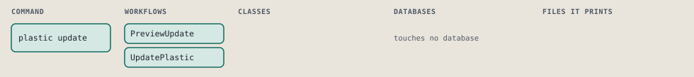
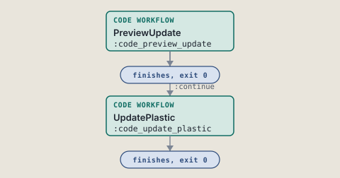
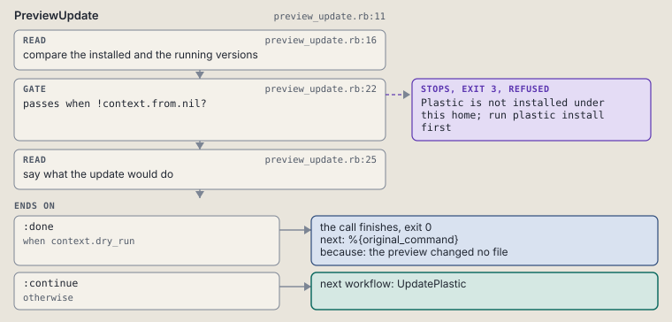
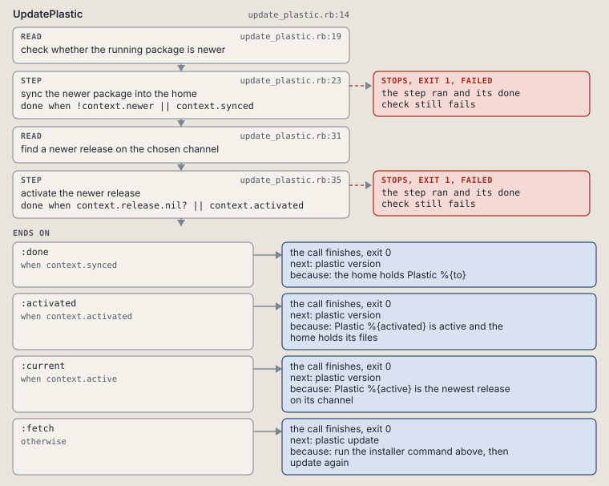

# plastic update

Sync a newer package into the home or name the installer command.

Syncs a newer running package into the home, or activates the newest release of the chosen channel, by default the active release's own.

```sh
plastic update [--channel NAME] [--dry-run]
```

The command is `Update`, in [`update.rb:10`](../../../../scripts/lib/plastic/commands/update.rb#L10). The words on this page, such as gate, step and outcome, are explained in [the command DSL](../../dsl/README.md).

| Argument or option | What it gives | Default |
| --- | --- | --- |
| `--channel NAME` | update from this channel: stable, beta or alpha |  |
| `--dry-run` | name both versions and change nothing | `false` |

## What it touches



## Before the chain

The command's own `call`, at [`update.rb:16`](../../../../scripts/lib/plastic/commands/update.rb#L16), runs first:

```ruby
def call
  channel = parsed[:channel]
  raise CLI::Command::Usage, "--channel takes stable, beta or alpha" unless [nil, *Workflows::ReleaseUpdate::CHANNELS.keys].include?(channel)

  super
end
```

## How the call flows



| Workflow | Kind | Code |
| --- | --- | --- |
| [PreviewUpdate](#previewupdate) | code | [`preview_update.rb:11`](../../../../scripts/lib/plastic/workflows/preview_update.rb#L11) |
| [UpdatePlastic](#updateplastic) | code | [`update_plastic.rb:14`](../../../../scripts/lib/plastic/workflows/update_plastic.rb#L14) |

### PreviewUpdate

The code workflow `:code_preview_update`, in [`preview_update.rb:11`](../../../../scripts/lib/plastic/workflows/preview_update.rb#L11).

Compares the installed version with the running package. A dry run names both and what the update would do.



| Step | Kind | Check | Code |
| --- | --- | --- | --- |
| compare the installed and the running versions | read |  | [`preview_update.rb:16`](../../../../scripts/lib/plastic/workflows/preview_update.rb#L16) |
| Plastic is not installed under this home; run plastic install first | gate, stops with exit 3 | `!context.from.nil?` | [`preview_update.rb:22`](../../../../scripts/lib/plastic/workflows/preview_update.rb#L22) |
| say what the update would do | read |  | [`preview_update.rb:25`](../../../../scripts/lib/plastic/workflows/preview_update.rb#L25) |

| Outcome | When | Then | Code |
| --- | --- | --- | --- |
| `:done` | when `context.dry_run` | finishes, exit 0; next: %{original_command} | [`preview_update.rb:32`](../../../../scripts/lib/plastic/workflows/preview_update.rb#L32) |
| `:continue` | otherwise | runs [UpdatePlastic](#updateplastic) | [`preview_update.rb:33`](../../../../scripts/lib/plastic/workflows/preview_update.rb#L33) |

It sets `from`, `to`.

### UpdatePlastic

The code workflow `:code_update_plastic`, in [`update_plastic.rb:14`](../../../../scripts/lib/plastic/workflows/update_plastic.rb#L14).

Syncs a newer running package into the home for the registered agents. When the running package is not newer, activates the newest release of the chosen channel, or of the active release's channel, and syncs its files into the home. With no release activated yet, names the installer command that installs one.



| Step | Kind | Check | Code |
| --- | --- | --- | --- |
| check whether the running package is newer | read |  | [`update_plastic.rb:19`](../../../../scripts/lib/plastic/workflows/update_plastic.rb#L19) |
| sync the newer package into the home | step | `!context.newer \|\| context.synced` | [`update_plastic.rb:23`](../../../../scripts/lib/plastic/workflows/update_plastic.rb#L23) |
| find a newer release on the chosen channel | read |  | [`update_plastic.rb:31`](../../../../scripts/lib/plastic/workflows/update_plastic.rb#L31) |
| activate the newer release | step | `context.release.nil? \|\| context.activated` | [`update_plastic.rb:35`](../../../../scripts/lib/plastic/workflows/update_plastic.rb#L35) |

| Outcome | When | Then | Code |
| --- | --- | --- | --- |
| `:done` | when `context.synced` | finishes, exit 0; next: plastic version | [`update_plastic.rb:39`](../../../../scripts/lib/plastic/workflows/update_plastic.rb#L39) |
| `:activated` | when `context.activated` | finishes, exit 0; next: plastic version | [`update_plastic.rb:40`](../../../../scripts/lib/plastic/workflows/update_plastic.rb#L40) |
| `:current` | when `context.active` | finishes, exit 0; next: plastic version | [`update_plastic.rb:42`](../../../../scripts/lib/plastic/workflows/update_plastic.rb#L42) |
| `:fetch` | otherwise | finishes, exit 0; next: plastic update | [`update_plastic.rb:44`](../../../../scripts/lib/plastic/workflows/update_plastic.rb#L44) |

It sets `newer`, `synced`, `active`, `release`, `activated`.

## Outcomes

Every call can also end in [the ways any call can end](../../dsl/README.md#how-any-call-can-end).

| Ending | Exit | next: | Code |
| --- | --- | --- | --- |
| Plastic is not installed under this home; run plastic install first | 3 | prints no next: line | [`preview_update.rb:22`](../../../../scripts/lib/plastic/workflows/preview_update.rb#L22) |
| the preview changed no file | 0 | %{original_command} | [`preview_update.rb:32`](../../../../scripts/lib/plastic/workflows/preview_update.rb#L32) |
| the home holds Plastic %{to} | 0 | plastic version | [`update_plastic.rb:39`](../../../../scripts/lib/plastic/workflows/update_plastic.rb#L39) |
| Plastic %{activated} is active and the home holds its files | 0 | plastic version | [`update_plastic.rb:40`](../../../../scripts/lib/plastic/workflows/update_plastic.rb#L40) |
| Plastic %{active} is the newest release on its channel | 0 | plastic version | [`update_plastic.rb:42`](../../../../scripts/lib/plastic/workflows/update_plastic.rb#L42) |
| run the installer command above, then update again | 0 | plastic update | [`update_plastic.rb:44`](../../../../scripts/lib/plastic/workflows/update_plastic.rb#L44) |
| a step raises | 1 | prints no next: line | [`code_workflow.rb:102`](../../../../scripts/lib/plastic/code_workflow.rb#L102) |
| Usage error: --channel takes stable, beta or alpha | 2 | prints no next: line | [`update.rb:18`](../../../../scripts/lib/plastic/commands/update.rb#L18) |
