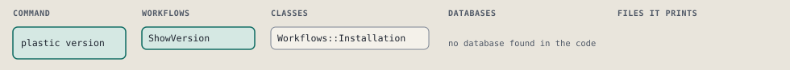
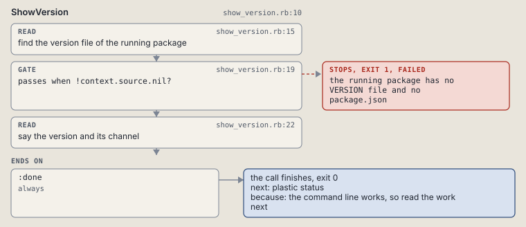

# plastic version

Print the installed Plastic version and release channel.

The version of the package this command came from, its channel and the file it was read from.

```sh
plastic version
```

The command is `Version`, in [`version.rb:9`](../../../../scripts/lib/plastic/commands/version.rb#L9). The words on this page, such as gate, step and outcome, are explained in [the command DSL](../../dsl/README.md).

## What it touches



## How the call flows


| Workflow | Kind | Code |
| --- | --- | --- |
| [ShowVersion](#showversion) | code | [`show_version.rb:10`](../../../../scripts/lib/plastic/workflows/show_version.rb#L10) |

### ShowVersion

The code workflow `:code_show_version`, in [`show_version.rb:10`](../../../../scripts/lib/plastic/workflows/show_version.rb#L10).

Reads the version of the running package: its VERSION file when it has one, as an installed copy does, otherwise its package.json.



| Step | Kind | Check | Code |
| --- | --- | --- | --- |
| find the version file of the running package | read |  | [`show_version.rb:15`](../../../../scripts/lib/plastic/workflows/show_version.rb#L15) |
| the running package has no VERSION file and no package.json | gate, stops with exit 1 | `!context.source.nil?` | [`show_version.rb:19`](../../../../scripts/lib/plastic/workflows/show_version.rb#L19) |
| say the version and its channel | read |  | [`show_version.rb:22`](../../../../scripts/lib/plastic/workflows/show_version.rb#L22) |

| Outcome | When | Then | Code |
| --- | --- | --- | --- |
| `:done` | always | finishes, exit 0; next: plastic status | [`show_version.rb:29`](../../../../scripts/lib/plastic/workflows/show_version.rb#L29) |

It sets `source`.

## Outcomes

Every call can also end in [the ways any call can end](../../dsl/README.md#how-any-call-can-end).

| Ending | Exit | next: | Code |
| --- | --- | --- | --- |
| the running package has no VERSION file and no package.json | 1 | prints no next: line | [`show_version.rb:19`](../../../../scripts/lib/plastic/workflows/show_version.rb#L19) |
| the command line works, so read the work next | 0 | plastic status | [`show_version.rb:29`](../../../../scripts/lib/plastic/workflows/show_version.rb#L29) |
| a step raises | 1 | prints no next: line | [`code_workflow.rb:102`](../../../../scripts/lib/plastic/code_workflow.rb#L102) |
