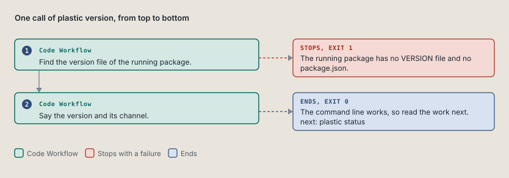

# plastic version

Print the installed Plastic version and release channel.

```sh
plastic version
```

## The events of one call, step by step



The boxes on the left run in order. The boxes on the right are the ways the call stops or ends at that step.

## What one call changes

This command changes nothing.

The command is `Plastic::Commands::Version`, in [`version.rb:9`](../../../../lib/plastic/commands/version.rb#L9).
