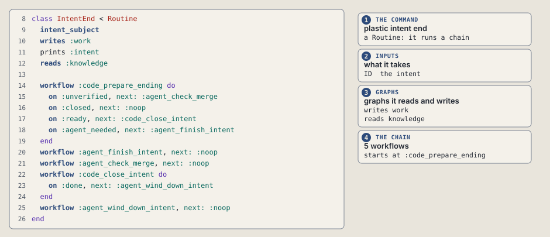
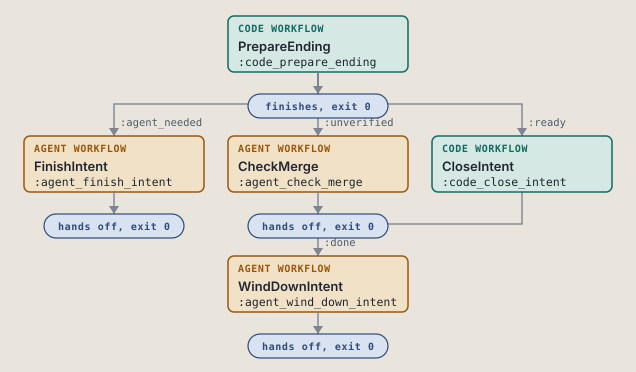
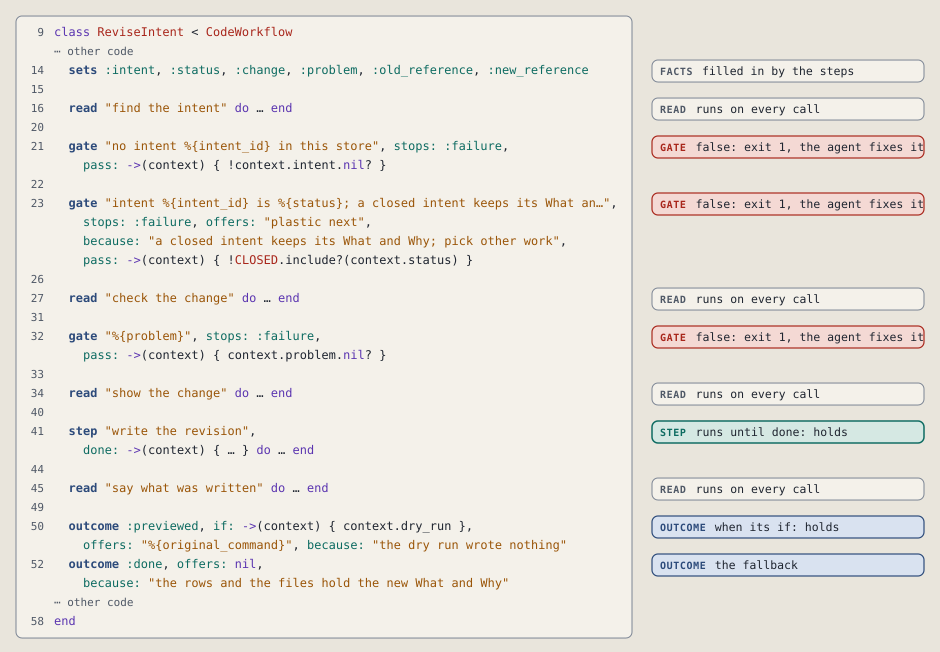
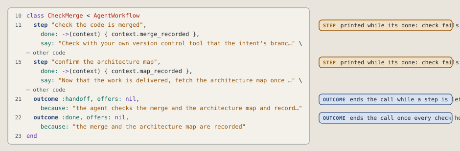
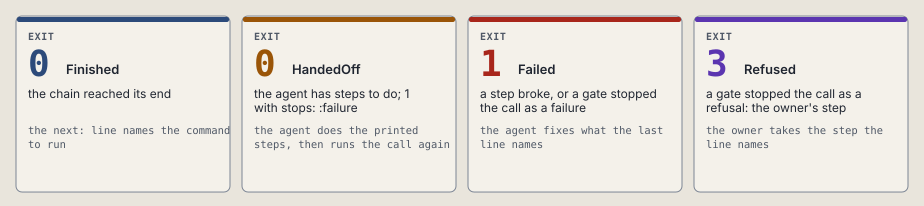

# The command DSL

Every plastic command is one Ruby class. The class declares what the command takes and a chain of workflows, and each workflow declares its steps and the ways it ends. Each drawing below shows real code from the kernel, and each table links the line that defines a word.

| Section | The words it covers |
| --- | --- |
| [Declare a command](#declare-a-command) | `intent_subject`, `argument`, `option`, `reads`, `writes` |
| [Wire the chain](#wire-the-chain) | `workflow`, `on`, `next:` |
| [Declare a code workflow](#declare-a-code-workflow) | `sets`, `read`, `gate`, `step`, `outcome` |
| [Declare an agent workflow](#declare-an-agent-workflow) | `step` with `say:`, `outcome` |
| [How a call ends](#how-a-call-ends) | `Finished`, `HandedOff`, `Failed`, `Refused` |
| [How any call can end](#how-any-call-can-end) | the endings every command shares |

---

## Declare a command

The class of [`plastic intent end`](../commands/intent-end/README.md), from [`intent_end.rb:8`](../../../scripts/lib/plastic/commands/intent_end.rb#L8). The numbers match each part of the class to what it declares. Long lines are wrapped.

| # | Word | What it declares | Defined in |
| --- | --- | --- | --- |
| 1 | `class Name < Routine` | The class is the command, and it runs a chain of workflows. | [`routine.rb:32`](../../../scripts/lib/plastic/routine.rb#L32) |
| 2 | `intent_subject` | The intent id as the first argument, and the subject of the call. | [`declarations.rb:25`](../../../scripts/lib/plastic/cli/declarations.rb#L25) |
| 2 | `node_subject` | An intent id and a node id, as the first two arguments. | [`declarations.rb:31`](../../../scripts/lib/plastic/cli/declarations.rb#L31) |
| 2 | `argument :name, label:, text:` | One word the command takes. `rest: true` takes every word left, and `optional: true` allows none. | [`declarations.rb:39`](../../../scripts/lib/plastic/cli/declarations.rb#L39) |
| 2 | `option :name, switch:, text:` | One switch. `default:` gives its value when the call leaves it out. | [`declarations.rb:43`](../../../scripts/lib/plastic/cli/declarations.rb#L43) |
| 3 | `reads :graph`, `writes :graph` | The graphs the command reads and writes: work, knowledge, retrieval, references. | [`declarations.rb:49`](../../../scripts/lib/plastic/cli/declarations.rb#L49) |
| 4 | `def call` then `super` | A check of its own before the chain. A usage error prints the usage line and exits 2. | [`command.rb:26`](../../../scripts/lib/plastic/cli/command.rb#L26) |
| 5 | `workflow` | One link of the chain, explained in [Wire the chain](#wire-the-chain). | [`routine.rb:39`](../../../scripts/lib/plastic/routine.rb#L39) |

---

## Wire the chain

Each `workflow` line draws a box, and each `on` line draws a wire between two boxes, labeled with the outcomes it carries.

| Line | What it means | Defined in |
| --- | --- | --- |
| `workflow :key do` then `end` | Runs `:key`. The `on` lines inside say where each outcome goes. | [`routine.rb:39`](../../../scripts/lib/plastic/routine.rb#L39) |
| `on :outcome, next: :key` | That outcome runs `:key` next. | [`branches.rb:13`](../../../scripts/lib/plastic/routine/branches.rb#L13) |
| `workflow :key, next: :other` | Every outcome of `:key` runs `:other` next. | [`chain.rb:25`](../../../scripts/lib/plastic/routine/chain.rb#L25) |
| `next: :noop` | The chain ends after `:key`. Its outcome line gives the `next:` and `because:` lines the call prints. | [`workflow.rb:58`](../../../scripts/lib/plastic/workflow.rb#L58) |

The first `workflow` line is the entry. An `on` line wins over a plain `next:`.

Before the first call, `verify` checks the wiring and raises every fault at once, from [`routine.rb:54`](../../../scripts/lib/plastic/routine.rb#L54). It refuses a chain when:

| Fault | Checked in |
| --- | --- |
| An edge points to a key that is not in the chain. | [`edge.rb:22`](../../../scripts/lib/plastic/routine/edge.rb#L22) |
| An edge points backward, so the chain could loop. | [`edge.rb:24`](../../../scripts/lib/plastic/routine/edge.rb#L24) |
| The entry cannot reach a workflow. | [`chain.rb:69`](../../../scripts/lib/plastic/routine/chain.rb#L69) |
| An outcome has no edge. | [`link.rb:27`](../../../scripts/lib/plastic/routine/link.rb#L27) |
| An edge names an outcome its workflow never returns. | [`link.rb:32`](../../../scripts/lib/plastic/routine/link.rb#L32) |
| Anything but `:noop` follows an agent workflow. | [`link.rb:40`](../../../scripts/lib/plastic/routine/link.rb#L40) |
| An outcome that ends the chain has no `because:` line. | [`link.rb:45`](../../../scripts/lib/plastic/routine/link.rb#L45) |
| A workflow prints a `%{name}` that nothing declares. | [`link.rb:52`](../../../scripts/lib/plastic/routine/link.rb#L52) |

---

## Declare a code workflow

`ReviseIntent`, the workflow `:code_revise_intent`, from [`revise_intent.rb:9`](../../../scripts/lib/plastic/workflows/revise_intent.rb#L9). The lines run from top to bottom. A block shows as `do ... end`, code that is not a DSL line shows as a gap, and long lines are wrapped and cut short.

| Word | Shape | When it runs | Stops the call | Defined in |
| --- | --- | --- | --- | --- |
| `sets` | `sets :intent, :status` | when the class loads | never | [`workflow.rb:37`](../../../scripts/lib/plastic/workflow.rb#L37) |
| `read` | `read "name" do` then `end` | on every call, a rerun included | only when it raises: exit 1 | [`code_workflow.rb:47`](../../../scripts/lib/plastic/code_workflow.rb#L47) |
| `gate` | `gate "reason", stops: :failure, pass: ->(c) { ... }` | in its place | when `pass:` is false: exit 1, the agent can fix it | [`code_workflow.rb:35`](../../../scripts/lib/plastic/code_workflow.rb#L35) |
| `gate` | `gate "reason", stops: :refusal, pass: ->(c) { ... }` | in its place | when `pass:` is false: exit 3, the owner's step | [`code_workflow.rb:35`](../../../scripts/lib/plastic/code_workflow.rb#L35) |
| `step` | `step "name", done: ->(c) { ... } do` then `end` | while `done:` is false, and `done:` must hold after it | when it raises: exit 1 | [`code_workflow.rb:65`](../../../scripts/lib/plastic/code_workflow.rb#L65) |
| `forget_stop` | `forget_stop :problem` | on every call | never | [`code_workflow.rb:54`](../../../scripts/lib/plastic/code_workflow.rb#L54) |
| `outcome` | `outcome :name, if: ->(c) { ... }` | after the steps: the first whose `if:` holds wins | never | [`code_workflow.rb:74`](../../../scripts/lib/plastic/code_workflow.rb#L74) |
| `outcome` | `outcome :name` | the fallback, with no `if:`; it comes last | never | [`code_workflow.rb:89`](../../../scripts/lib/plastic/code_workflow.rb#L89) |

A block does the work. A keyword lambda, `done:`, `pass:` or `if:`, answers a question and changes nothing.

An outcome that ends the chain also takes `offers:`, the command that `next:` prints, and `because:`, the reason for it.

---

## Declare an agent workflow

`CheckMerge`, the workflow `:agent_check_merge`, from [`check_merge.rb:10`](../../../scripts/lib/plastic/workflows/check_merge.rb#L10).

| Word | Shape | What it does | Defined in |
| --- | --- | --- | --- |
| `step` | `step "name", done: ->(c) { ... }, say: "... %{fact} ..."` | One thing the agent does. A call prints the `say:` text of each step whose `done:` check fails, with every `%{fact}` filled in. | [`agent_workflow.rb:26`](../../../scripts/lib/plastic/agent_workflow.rb#L26) |
| `outcome :handoff` | `outcome :handoff, offers:, because:` | Ends the call while a step is left: exit 0, or exit 1 with `stops: :failure`. | [`agent_workflow.rb:47`](../../../scripts/lib/plastic/agent_workflow.rb#L47) |
| `outcome :done` | `outcome :done, offers:, because:` | Ends the call once every `done:` check holds. | [`agent_workflow.rb:50`](../../../scripts/lib/plastic/agent_workflow.rb#L50) |

An agent workflow always ends the chain. The agent reports its work through a plastic command, and the next call checks the steps again.

---

## How a call ends

No workflow picks an exit code. A call ends in one of these four values, and the value prints the last lines and gives the code.

| Value | Exit | Defined in |
| --- | --- | --- |
| `Finished` | 0 | [`finished.rb:20`](../../../scripts/lib/plastic/finished.rb#L20) |
| `HandedOff` | 0 | [`handed_off.rb:8`](../../../scripts/lib/plastic/handed_off.rb#L8) |
| `Failed` | 1 | [`failed.rb:10`](../../../scripts/lib/plastic/failed.rb#L10) |
| `Refused` | 3 | [`refused.rb:9`](../../../scripts/lib/plastic/refused.rb#L9) |

## How any call can end

These endings hold for every command, so a command page lists only its own.

| Ending | Exit | next: | Code |
| --- | --- | --- | --- |
| a wrong argument or option | 2 | prints the usage line | [`command.rb:89`](../../../scripts/lib/plastic/cli/command.rb#L89) |
| `--help` | 0 | prints the help | [`command.rb:73`](../../../scripts/lib/plastic/cli/command.rb#L73) |
| a missing store | 1 | the command that creates the store | [`command.rb:93`](../../../scripts/lib/plastic/cli/command.rb#L93) |
| a broken projects file | 1 | prints no next: line | [`command.rb:107`](../../../scripts/lib/plastic/cli/command.rb#L107) |
| a step whose done check still fails | 1 | prints no next: line | [`step.rb:14`](../../../scripts/lib/plastic/code_workflow/step.rb#L14) |
| a step that raises, except a usage error, which keeps exit 2 | 1 | prints no next: line | [`code_workflow.rb:103`](../../../scripts/lib/plastic/code_workflow.rb#L103) |
| a print failure after the chain | 1 | prints no next: line | [`printing.rb:17`](../../../scripts/lib/plastic/routine/printing.rb#L17) |
| a closing line that cannot fill | 1 | prints no next: line | [`finished.rb:29`](../../../scripts/lib/plastic/finished.rb#L29) |
| an agent handoff that cannot print | 1 | prints no next: line | [`agent_workflow.rb:54`](../../../scripts/lib/plastic/agent_workflow.rb#L54) |
| a dry run that cannot open its database | 1 | prints no next: line | [`preview.rb:38`](../../../scripts/lib/plastic/routine/preview.rb#L38) |
| a dry run that cannot copy the store | 3 | prints no next: line | [`preview.rb:46`](../../../scripts/lib/plastic/routine/preview.rb#L46) |

---

## Where the DSL lives

| File | What it defines |
| --- | --- |
| [`routine.rb`](../../../scripts/lib/plastic/routine.rb) | the command class and `workflow` |
| [`cli/declarations.rb`](../../../scripts/lib/plastic/cli/declarations.rb) | `intent_subject`, `argument`, `option`, `reads` and `writes` |
| [`routine/branches.rb`](../../../scripts/lib/plastic/routine/branches.rb) | `on` |
| [`routine/chain.rb`](../../../scripts/lib/plastic/routine/chain.rb) | the chain and its wiring checks |
| [`workflow.rb`](../../../scripts/lib/plastic/workflow.rb) | what both kinds of workflow share: `sets` and `outcome` |
| [`code_workflow.rb`](../../../scripts/lib/plastic/code_workflow.rb) | `read`, `gate`, `step` and `forget_stop` |
| [`agent_workflow.rb`](../../../scripts/lib/plastic/agent_workflow.rb) | the agent `step` and its handoff |
| [`finished.rb`](../../../scripts/lib/plastic/finished.rb) | the four end values |
