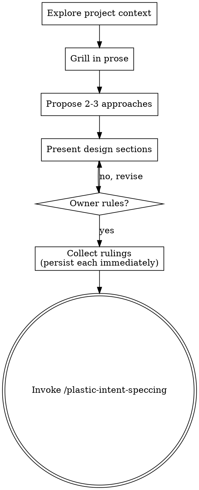

# Design Principles: Unit Boundaries and Existing Codebases

General good-developer guidance behind two parts of the Process: how to design for
isolation and clarity, and how to behave in an existing codebase. Also holds the
Process Flow diagram (the same ordered flow the Checklist already states as numbered
steps).

## Design for isolation and clarity

- Break the system into smaller units that each have one clear purpose, communicate through well-defined interfaces, and can be understood and tested independently
- For each unit, you should be able to answer: what does it do, how do you use it, and what does it depend on?
- Can someone understand what a unit does without reading its internals? Can you change the internals without breaking consumers? If not, the boundaries need work.
- Smaller, well-bounded units are also easier for you to work with - you reason better about code you can hold in context at once, and your edits are more reliable when files are focused. When a file grows large, that's often a signal that it's doing too much.

## Working in existing codebases

- Explore the current structure before proposing changes. Follow existing patterns.
- Where existing code has problems that affect the work (e.g., a file that's grown too large, unclear boundaries, tangled responsibilities), include targeted improvements as part of the design - the way a good developer improves code they're working in.
- Don't propose unrelated refactoring. Stay focused on what serves the current goal.

## Process Flow (diagram)

The Checklist above already states this ordered flow as numbered steps 1-6; this
diagram is the same flow in a visual form.

